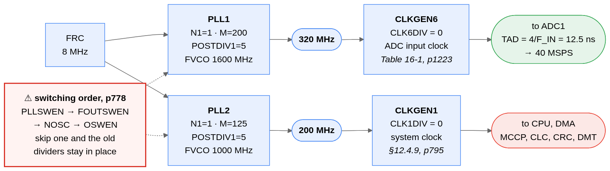
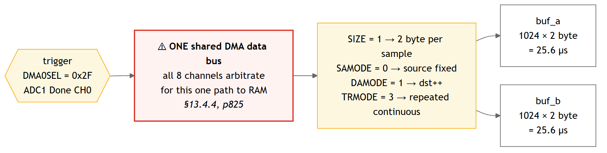
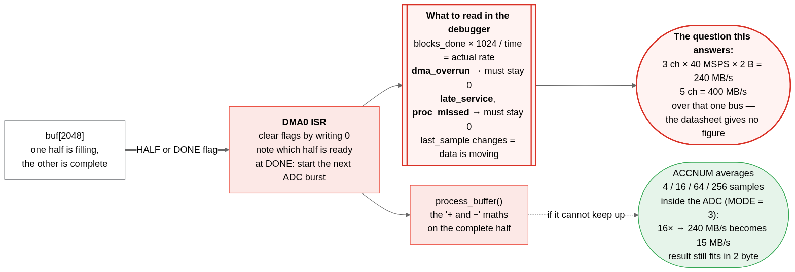

# dsPIC33AK512MPS512 on the dsPIC33 Curiosity Platform — ADC at 40 MSPS into RAM via DMA

A small, complete MPLAB X project showing **how to configure the device** so the
ADC runs at its maximum rate and the DMA moves the samples into RAM — and **how to
measure whether it really keeps up**. A command console on the board's USB-UART
channel controls it from a terminal or a script.

It is cut to the **EV74H48A** (dsPIC33 Curiosity Platform Development Board) with the
**dsPIC33AK512MPS512 General Purpose DIM** plugged in — the same hardware Microchip's own
40 MSPS example runs on. Order the two, open the project, press Program, and the LED
tells you whether the chain works, before you connect any signal. The source builds
unchanged for the other dsPIC33AK512MPS5xx parts; only the project's device selection and
the pin table differ.

Bare metal, no MCC. Every register write in the source cites the datasheet table or
page it comes from, so nothing has to be taken on trust.

## Existing examples we looked at first

Before writing anything we searched Microchip's own example organisation
[`microchip-pic-avr-examples`](https://github.com/orgs/microchip-pic-avr-examples/repositories?q=dspic33a)
for something that already did this. These are the ones we evaluated:

| Repository | What it does | What we took from it |
|---|---|---|
| [dspic33ak-curiosity-adc-40msps](https://github.com/microchip-pic-avr-examples/dspic33ak-curiosity-adc-40msps) | **40 MSPS ADC on dsPIC33AK128MC106 and dsPIC33AK512MPS512** — MCC-generated, runs on a Curiosity board. Reads conversions in software; **no DMA**. | Studied in detail. **Our clock setup and our ADC trigger scheme follow it**, because that code has been on silicon and ours has not. |
| [dspic33a-dac-dma-sinewave](https://github.com/microchip-pic-avr-examples/dspic33a-dac-dma-sinewave) | DAC fed by DMA to emit a 100 Hz sine without CPU intervention. | Checked for DMA setup patterns: it sets the DMA address window and clears the status flags by writing 0 — both of which we had wrong before the 2026-09-22 review. |
| [dspic33a-curiosity-dma-spi-eeprom-demo](https://github.com/microchip-pic-avr-examples/dspic33a-curiosity-dma-spi-eeprom-demo) | SPI transfers driven by DMA. | DMA, but not from an ADC and not at rate. |
| [dspic33a-code-examples](https://github.com/microchip-pic-avr-examples/dspic33a-code-examples) | Collection of smaller dsPIC33A examples. | Scanned for an ADC-plus-DMA combination; there is none. |
| [dspic33ak512mps506-dppim-demo](https://github.com/microchip-pic-avr-examples/dspic33ak512mps506-dppim-demo) | PWM and ADC on the dsPIC33AK512MPS506. | PWM-triggered conversion, not continuous sampling into memory. |

**The gap this project fills: ADC and DMA together, at full rate, with counters.**
The official 40 MSPS example proves the ADC reaches 40 MSPS. It does not answer how
much of that actually arrives in RAM, because it does not use the DMA — and on this
device all eight DMA channels share a single data bus (DS70005591D §13.4.4, p825),
with no throughput figure given anywhere.

**If you only need the ADC and can read conversions in software, use the official
example instead of this one.** It has run on hardware.

### What comes from where

To be precise about how much of this code rests on something that has run on silicon:

| Part of this code | Origin | Has run on hardware? |
|---|---|---|
| Clock setup: PLL1/PLL2 divider values, CLKGEN1/CLKGEN6 settings, switching sequence | bit-identical to the MCC-generated `clock.c` of [dspic33ak-curiosity-adc-40msps](https://github.com/microchip-pic-avr-examples/dspic33ak-curiosity-adc-40msps) | yes, in that example |
| ADC trigger scheme: Integration mode, software trigger starts a burst, the conversions inside it run back-to-back (`MODE = 2`, `TRG1SRC = 1`, `TRG2SRC = 2`, `AD3SWTRG`) | the same as Microchip's 40 MSPS example, plus Example 16-6 (p1331) for the burst | yes — and by elimination. Every documented way to pace the conversions inside a burst was tried on the board and none worked (`docs/HARDWARE-LOG.md` runs 4 to 7): the repeat timer and `SAMC` are ignored, the SCCP1 trigger produces no conversion at all. Back-to-back is what is left, and the rate comes from the ADC clock |
| DMA basics: `DMALOW`/`DMAHIGH` window, status flags cleared by writing 0, control register layout | MCC `dma.c` of [dspic33a-dac-dma-sinewave](https://github.com/microchip-pic-avr-examples/dspic33a-dac-dma-sinewave) and datasheet Examples 13-1 to 13-4 (p832 ff.) | yes — but memory-to-DAC in Repeated One-Shot mode, the opposite direction and a far lower rate |
| **ADC burst → DMA in Repeated One-Shot mode (Repeated Continuous until 25.09.2026, see `dma.c`) → one buffer with `HALF`/`DONE` interrupts → burst restarted from the `DONE` ISR** | **our own construction**, assembled from datasheet §13.4.8 (Example 13-4, p835), §13.6.1.2 (HALF interrupt, p848) and §16.4.5 (p1322) | **no.** There is no Microchip example for this combination. This is the part `docs/TROUBLESHOOTING.md` §1.1 flags as the remaining risk |
| Self-test on the internal 15/16·VDD reference (ADxAN6) | the input and its sample time come from datasheet Example 16-3 (p1328), which uses it for gain calibration; the pass/fail logic is ours | the input yes, the check no |
| Board pins, UART2 on the MCP2221A channel, PPS codes, baud generator setting | the MCC-generated `pins.c` and `uart2.c` of the same 40 MSPS example (`RPINR13bits.U2RXR = 0x32`, `RPOR28bits.RP114R = 0x15`, `U2BRG = 0x364`) and the DIM info sheet | yes, in that example |
| Command parser (`cmd_parser.c/.h`) | [zabooh/cmd_parser](https://github.com/zabooh/cmd_parser), copied unchanged; it has run on a SAM E54 and a PIC32CM there | yes, on other targets — not yet on this one |
| Console commands, transport, receive interrupt (`cli.c`) | our own | no |
| Measurement counters, ISR, `main.c`, LED reporting, bounded waits, file structure | our own | no |

Nothing was copied verbatim. The examples served as the reference for register values
and patterns; every line here was written for this project and cites the datasheet
page it rests on.

## Read this first

**The result, in one document: [`docs/RESULTS.md`](docs/RESULTS.md)** (25.09.2026). The
chain SCCP1 → ADC → DMA → ping-pong → CPU streams without loss up to 8 MSPS with the CPU
processing every half, proven on the board; the report explains how it was found, what
the limits are and what is still open. The history below is kept as it was written.

**What has run on hardware.** Since 23.09.2026 this code runs on the EV74H48A, and
thirteen runs are recorded with their logs in `docs/HARDWARE-LOG.md`. As of 24.09.2026
the following is proven on silicon, not argued from the datasheet:

- Clock tree, console, ADC core, DMA channel and the self-test on the internal
  reference.
- **The measurement chain itself.** With a known triangle from the on-chip DAC routed
  to the ADC, one captured buffer contains the triangle: a clean rise, one turning
  point, a clean fall, the largest step between two neighbouring samples 113 counts out
  of a swing of 1440, no jump and no gap (run 13). **The ADC converts a real changing
  signal and the DMA places every result in the ping-pong buffer, complete and in the
  order it was converted.**
- **The sample rate follows the setting.** One clean burst, timed with Timer1, delivered
  3990 kSPS against 4081 nominal — 2.2 % off (run 13).

**What is not settled.** How far up that stays true. At the undivided clock the DMA
loses samples to overruns - `dma_overrun` reaches about 4 % of the sample count, and
that is a lower bound, because the counter moves once per handler entry that finds the
flag set and not once per lost sample - and because every overrun raises the DMA
interrupt — 1.6 million per second, one every 625 ns — the CPU stops coming back to the
main loop at all. The rate at which the chain stays lossless is exactly what the sweep
is for, and the table from a board is still outstanding.

**One number to distrust.** Every rate figure measured *under load* in runs 4 to 11 —
the sweep's old `measured` column — is wrong by about a factor of ten. It was taken by a
CPU drowning in the overrun interrupt. The sweep now measures each rate on a single
clean burst as well and prints both, because the difference between the two columns is
the artefact itself.

**Two things about this device that cost us four days**, both in `docs/HARDWARE-LOG.md`
with register evidence, and both worth knowing before you trust a datasheet page here:

1. Nothing paces the conversions inside a burst. The ADC's repeat timer (`TRG2SRC = 3`,
   `RPTCNT`) and the SCCP1 trigger were configured correctly, read back correctly and
   ignored; `SAMC` does not change the rate either. The conversions run back-to-back and
   the only thing that changes the rate is the ADC clock.
2. The CLKGEN6 divider does not change the ADC clock. Every ratio was written, read back
   and confirmed by `DIVSWEN` and `CLKRDY` — with the generator switched off around the
   write and with it left running as Example 12-2 prescribes — and the rate did not
   move. The ADC also kept converting with CLKGEN6 switched off entirely. **The rate is
   set with PLL1's output dividers instead**, which works.

Parts of this example were **AI-assisted**. All register names, bitfields and value
ranges were taken from datasheet **DS70005591D**, the errata **DS80001162E** and the
ATDF files of the **dsPIC33AK-MP_DFP** device pack, and each one is cited at the point
of use — so every setting can be checked against the primary source.

**Revision history**

- **2026-09-24, nine more runs on the board, and the chain proved** (runs 5 to 13, all
  in `docs/HARDWARE-LOG.md`). The firmware was rebuilt around what the board actually
  does:
  - **Back-to-back only.** The repeat timer, the SCCP1 trigger as second and as first
    trigger, `sccp.c/.h`, the pacing selection and the `pacing`/`period` commands are
    gone: four mechanisms, four times ignored by the hardware.
  - **The rate comes from PLL1's output dividers**, 1600 MHz / (POSTDIV1 · POSTDIV2),
    40 down to 4.08 MSPS with 8 MSPS exactly on the ladder. The CLKGEN6 divider is kept
    as the `clk` command with a warning; do not build on it.
  - **Nothing runs by itself.** The firmware boots, sets the slowest rate and waits.
    `test` lists the parts of a run, `test all` runs them. The reason: through seven runs
    the console never received a byte, and only an idle board could show that this was
    the receive interrupt starving behind the DMA interrupt rather than a wiring fault.
  - **An emergency brake in the DMA handler.** Past 500 000 overruns in one measurement
    it masks its own interrupt and takes the channel down, so a rate that floods the CPU
    ends in a log line instead of a silent board.
  - **A DAC test that proves the data.** The on-chip DAC2 is routed to the ADC *inside
    the chip* over the UREF line, so no pin and no wire are involved; one buffer is
    captured with the stream stopped from the interrupt, and the judgement is made
    afterwards on the stored samples.
- **2026-09-23, first runs on the board** (four of them). Found and fixed: the console's
  tail garbled at the clock switch (flush first); a lost DMA `DONE` because the interrupt
  flag was cleared at the end of the handler and the status flags by read-modify-write;
  the sample buffer is a dedicated volatile object with guard words and the DMA window is
  exactly that buffer; `RCON` is reported at boot; the rate is measured with Timer1. The
  source was also split into modules (`board.h`, `clock`, `adc`, `dma`, `capture`, `led`,
  `diag`, `cli`) with a simulator build for the buffer logic.
- **2026-09-22, after the first report from a board** — the project's tool is the PKOB4
  (`pkob4hybrid`). A first attempt had run against a PC-side tool instead of the board
  and looked like a dead board; that was the whole cause. A second change made in the
  same breath — setting `OSCCTRL.PLLxEN` and waiting for `PLLxRDY` before the first
  divider switch — was reverted after review: it rests on Example 16-3, a snippet from
  the ADC chapter whose own arithmetic is wrong, and it waits for a lock on the POR
  dividers. The clock code follows the MCC sequence again, which has run on silicon.
- **2026-09-22, third revision** — moved to the **EV74H48A** with the dsPIC33AK512MPS512
  DIM (the board of Microchip's own 40 MSPS example): ADC3 on the mikroBUS A analog pin,
  LED0 on RC8, pin table below. A **command console** (`cli.c`, on the parser from
  [zabooh/cmd_parser](https://github.com/zabooh/cmd_parser)) on the MCP2221A USB-UART
  channel. The console runs in the UART receive interrupt below the DMA interrupt.
- **2026-09-22, second revision** — tailored so that the first run needs nothing but
  the board: a **self-test** on the ADC's internal 15/16·VDD reference runs before the
  external input is used; **LED0 reports** heartbeat, error and a stop code; every
  hardware wait loop is **bounded** and reports where it gave up instead of hanging.
- **2026-09-22** — full review against the datasheet, the errata and Microchip's MCC
  examples. Four mistakes found and fixed, all of which would have stopped the first
  run dead: (1) the ADC was set to single-conversion mode with a re-trigger source,
  which the datasheet says is ignored in that mode — it would never have converted;
  (2) `DMALOW`/`DMAHIGH` were left at their reset value 0, so the first DMA write would
  have faulted and disabled the channel; (3) the DMA status flags were "cleared" by
  writing 1 — they clear on 0 — so every counter would have stuck; (4) the two sample
  buffers were swapped by rewriting the DMA destination inside the ISR while the
  transfer was already running, which splits every block. Details in the sections below
  and in `docs/TROUBLESHOOTING.md`.
- **2026-09-21** — first version.

## Getting started

**You need:** an EV74H48A (dsPIC33 Curiosity Platform Development Board) with the
dsPIC33AK512MPS512 GP DIM — or a dsPIC33AK512MPS506 Curiosity Nano (EV17P63A), then
pick the MPLAB X configuration `EV17P63A_Curiosity_Nano_MPS506` — a USB cable, MPLAB X with the XC-DSC compiler and the
dsPIC33AK-MP device pack (MPLAB X offers to download the pack when you open the
project). A signal source is optional — the self-test does not need one. A terminal
program (Tera Term, PuTTY, MPLAB Data Visualizer's terminal) is optional too — the LED
and the debugger tell you the same things.

1. Plug the board in. The PKOB4 debugger enumerates for programming, and the
   MCP2221A's COM port appears for the console (user guide DS70005562D 2.1.1).
2. Open `adc_dma_40msps.X`, press **Build**, then **Program** (or **Debug**).
3. The project's tool is the board's **PKOB4** (`pkob4hybrid`). Check it once in the
   Dashboard or under *Project Properties → Conn.* — it has to be a real debugger, or
   the code never reaches the board and the silent COM port looks exactly like a
   broken one.
4. Watch LED0 (green, the row of eight): **slow blink = everything works.** The
   self-test on the internal reference has passed, the ADC, the DMA and the interrupt
   are running at 40 MSPS. What the other patterns mean is under "First run on
   hardware".
5. Open the MCP2221A's COM port at 115200 8N1, press Enter, type `status`. The reply
   is the counter table; `help` lists the rest. See "The console" below.

Verified on 2026-09-22 with:

| Tool | Version |
|---|---|
| MPLAB X IDE | v6.35 (project format `version="65"`, which v6.25 also reads) |
| XC-DSC compiler | v3.31.00; the source also builds with v3.21 when the pack supplies the device |
| Device pack | dsPIC33AK-MP_DFP **1.4.260 and 1.3.185** — the source builds against both, `-Wall -Wextra` clean |
| Target | dsPIC33AK512MPS512 (project); the source also builds for the MPS506 |
| Board | EV74H48A + dsPIC33AK512MPS512 GP DIM, user guide DS70005562D, DIM info sheet DS70005563A |

**If MPLAB X complains about the toolchain version** when you open the project: the
`.X` has a version recorded in it, and yours will differ. Go to *Project Properties →
XC-DSC* and pick the version you have. Nothing in the source depends on it — we have
built this with v3.21 and v3.31, and the configuration bits are written so that the
pack version does not matter either (see "One trap worth knowing about" below).

### The board

Everything this example touches on the EV74H48A with the dsPIC33AK512MPS512 DIM, from
the DIM info sheet DS70005563A (Table 1, DIM pin → device pin → board function) and the
board user guide DS70005562D:

| What | Device pin | DIM pin | Where on the board | Note |
|---|---|---|---|---|
| **Analog input** AD3AN5 (default) | RA0 | P77 | **mikroBUS A, pin AN** | 0 … 3.3 V against GND. Same input as Microchip's 40 MSPS example. `ADC_INSTANCE 3`, `ADC_PINSEL 5` |
| Potentiometer AD5AN0 | RA7 | P66 | the 10 kΩ pot | for a knob-driven demo: `ADC_INSTANCE 5`, `ADC_PINSEL 0`, and `samc` ≥ 9 — the pot is a high-impedance source |
| Internal reference ADxAN6 | — | — | inside the ADC | 15/16·VDD, used by the self-test on every core |
| **LED0** | RC8 | P28 | leftmost of the eight green LEDs | driven high to light. LED1…7 are RC9…RC15 |
| S1, S2, S3 | RF3, RF0, RB2 | P45, P43, P41 | push buttons | active low, pull-up on the board; not used by this example |
| **Console UART2** | TX RH1 (RP114), RX RD1 (RP50) | P98, P96 | **MCP2221A USB-UART channel** — its own COM port | 115200 8N1, the channel Microchip's example streams to Data Visualizer on |
| Second UART | TX RH0 (RP113), RX RD10 (RP59) | P102, P100 | PKOB4 USB-UART channel, another COM port | not used by this console |
| Debugger | — | — | PKOB4 via the USB connector J24 | programming and debugging; the console's COM port is on the same USB cable, via the MCP2221A |
| GND | — | — | mikroBUS GND pins, test points | signal ground for the generator |

AD1AN0 of this device sits on RA2, which the board routes to a capacitive touch pad
(P38) — that is why the example uses ADC3 here and not ADC1.

The sources sit in the repository root — `main.c`, one `.c/.h` pair per module (`clock`,
`adc`, `dma`, `capture`, `led`, `diag`, `cli`/`console`), `board.h` and the parser pair
`cmd_parser.c/.h` — and the MPLAB X project references them there; nothing is duplicated.
`main.c` is the place to read first: it is the start-up order and the main loop, and
nothing else.

**This needs real hardware.** The clock generators, the PLLs, the ADC and the DMA are
the four things this example is about, and all four only exist on silicon. The number
that matters — `dma_overrun` staying at 0 at full rate — cannot be produced anywhere
else. The project is therefore set up for the board: the tool is the PKOB4
(`pkob4hybrid`). A second configuration, `sim`, runs the same code in the MPLAB X
simulator with a stand-in for the DMA — useful for the software above the DMA, useless
for the four things above; see "In the MPLAB X simulator" below.

One part is worth exercising on its own: `process_buffer()`. Write test values into
`buf`, call it directly, and you can check your arithmetic and its cycle count on a
host compiler without a board.

The `tools/` folder builds the same file from the command line without the IDE. **You
can ignore it** — we use it to check that the code compiles against different
compiler and pack versions.

### The other board: dsPIC33AK512MPS506 Curiosity Nano (EV17P63A)

The same code runs on the Curiosity Nano, which carries the 64-pin
**dsPIC33AK512MPS506** (user guide DS70005634). Everything that differs is in
`board.h` under `BOARD_EV17P63A`, and the MPLAB X configuration **`EV17P63A_Curiosity_Nano_MPS506`** selects it
(device MPS506, the on-board debugger `nEdbgTool`, `BOARD=2`); on the command line it is
`tools\build.bat nano` or `make -C tools nano`. The two devices share the ADC, the DMA,
the clock tree and the RAM map; the only configuration word that differs is
`FDEVOPT_ALTI2C3`, which the 64-pin part does not have.

| Function | Pin | Where | Notes |
|---|---|---|---|
| **Analog input** AD1AN0 | RA2 (RP3, QFN64 pin 12) | edge connector, labelled "RA2 / AD1AN0" | `ADC_INSTANCE 1`, `ADC_PINSEL 0`; shares the pin with OA1OUT/CMP1A, both off after reset |
| Internal reference ADxAN6 | — | inside the ADC | 15/16·VDD, the self-test input on every core |
| **LED0** | RD0 (RP49) | the yellow LED | **active low** — `LED_ACTIVE_LOW 1` |
| SW0 | RC3 (RP36) | push button | no external pull-up; not used by this example |
| **Console UART2** | TX RC10 (RP43), RX RC11 (RP44) | the debugger's CDC channel, one COM port | 115200 8N1; DS70005634 6.2: RC10 is the target's TX line (debugger CDC RX), RC11 the target's RX line (debugger CDC TX) |
| Debugger | — | the on-board nEDBG via the USB connector | programming, debugging and the console share the one cable |
| GND | — | edge connector | signal ground for the generator |

The generator goes to RA2 and GND on the edge connector. Nothing on the Nano has run
yet at the time of writing (`docs/HARDWARE-LOG.md`); the EV74H48A is where the
measurements come from, and the results carry over because the silicon is the same.

**The chain on the Nano.** Everything the chain uses exists on the 64-pin part as well
(ADC core 5, SCCP1, the clock monitor, DAC2, `_AD5CH0Interrupt`), so `chain all`,
`stream on` and the GUI work unchanged; checked against the MPS506 device header and
by building, not yet on a Nano. The DAC test triangle comes out on **RA8 = DACOUT2 =
AD5AN3**, edge connector right row, position 10 - the plain `stream on <ksps>` samples
it there with no wire. A real signal goes to **RA2 = AD1AN0** (right row, position 8),
which is `stream on <ksps> 1 0` and the GUI's default custom input on this board.

**The GUI follows the board by itself:** after connecting it reads the board name from
the firmware's `version` reply (`[build] board: EV17P63A, ...`), switches the board
profile - pinout, edge-connector diagram - and sets that board's default input
(core 1, PINSEL 0 on the Nano; core 3, PINSEL 5 = mikroBUS A AN on the EV74H48A). The
console port is the Nano debugger's CDC channel. Without a board:
`toolsdc_gui.bat --fake --fake-board EV17P63A` lets the stand-in report the Nano.

## First run on hardware

**The firmware runs no test by itself.** It boots, brings the console up, sets the
slowest sample rate and waits. Everything else is typed. That is deliberate: through
seven board runs the console never received a byte, and it could not be told whether the
bytes never arrived or whether the receive interrupt was starving behind the DMA
interrupt. With nothing converting after the boot, that question answers itself — and it
turned out to be the starvation.

### Step 1 — the console answers

Open the board's USB-UART channel at 115200 8N1 and reset. About a dozen lines appear,
ending in `[boot] READY`. Then type a character: it echoes. Then type `help`.

If nothing echoes, stop here — it is the terminal, the COM port or the wiring, not the
firmware. Nothing is converting at this point, so nothing can starve the receiver.

### Step 2 — run the parts of a test

```
test              lists the parts and what each one proves
test all          self, clock, clkoff, sweep, dac, in that order, with a verdict
test self         ADC -> DMA -> RAM on the internal 15/16*VDD reference
test clock        switch every CLKGEN6 ratio and read it back (no measurement)
test clkoff       switch CLKGEN6 off: does the ADC still convert?
test rate         delivered rate at the rate set now, from one clean burst
test sweep        the rate ladder, slowest first, with the counters
test dac          the DAC triangle through the chain: is everything there, in order?
```

`test all` stops only if `test self` fails — without a working chain every number after
it is meaningless. Everything else runs to the end and reports.

Two commands set the rate by hand: `pll <p1> <p2>` (the one that works) and `clk <ratio>`
(the CLKGEN6 divider, which does not change the rate on this silicon and is kept for the
record). `regs` prints the register dump.

### Step 3 — read the LED

| LED0 | Meaning |
|---|---|
| **slow blink, 1 Hz** | running, no error counter has moved. This is the goal. |
| fast blink, 5 Hz | running, but an error counter is non-zero — `dma_overrun`, `late_service`, `proc_missed`, `dma_addr_err` or `dma_bus_err`. |
| *n* short blinks, pause, repeat | stopped at a checkpoint; *n* is the code below. `fail_code` holds the same number. |
| dark, or steadily on | nothing runs at all: not programmed, no power, or stopped in a debugger |

The stop codes:

| Code | Stopped because | Look at |
|---|---|---|
| 1 | PLL1 (ADC clock) did not configure or lock | `PLL1DIV`, `OSCCTRL` |
| 2 | PLL2 (system clock) did not configure or lock | `PLL2DIV`, `OSCCTRL` |
| 3 | CLKGEN1 did not switch to PLL2 | `CLK1CON` |
| 4 | CLKGEN6 did not switch to PLL1 | `CLK6CON` |
| 5 | the ADC core never reported ready | `AD3CON`, `CLK6CON.CLKRDY` |
| 6 | no DMA blocks arrived, or the stream stopped later | `AD3CH0CNT.CNTSTAT`, `DMA0CNT`, `DMA0SEL`, `IEC2` |
| 7 | self-test value out of range | `selftest_mean` — expected ≈ 3840, window 3648 … 4032 |
| 8 | the DMA channel switched itself off | `dma_addr_err`, `DMALOW`, `DMAHIGH` |
| 9 | a CPU trap or an interrupt with no handler | the `[TRAP]` block on the console — it names the vector, the boot stage and the `INTCON*` cause bits. `docs/TROUBLESHOOTING.md` §2.0b |
| 10 | the fail-safe clock monitor moved the CPU to the backup FRC | the `[CLKF]` lines: `OSCCTRL`, `PLL2CON`, `CLK1CON` |
| 11 | something wrote past the end of the sample buffer | the `[guard]` lines: which of the 16 guard words behind `buf` changed and what it holds. A 12-bit value there means the DMA ran past the buffer |

**What the self-test proves, and what it cannot.** It runs the identical clock, ADC, DMA
and interrupt chain on the ADC's internal 15/16·VDD reference (AD3AN6, Table 16-2) and
checks that the mean of a buffer half is 3840 ± 5 %. That is a real end-to-end check of
the wiring — but it samples a **constant**, so a result register that never changed would
give exactly the same mean. Only the DAC test can tell those apart, which is why it
exists.

**The counters**, readable with `status` or a debugger:

| Variable | Should be |
|---|---|
| `blocks_done` | increasing while a test runs a stream |
| `selftest_mean` | ≈ 3840 |
| `last_sample` | changing once a signal is connected; noise around some level on an open pin |
| `dma_overrun` | **0** at a usable rate. Above that it is a *lower bound* on the samples lost: `OVERRUN` is one bit and the counter moves once per handler entry that finds it set, so several losses between two entries count as one. `blocks_done` against `burst_starts` is the exact relation - one burst is a whole buffer, so blocks must be twice bursts |
| `dma_addr_err` | **0** — non-zero means the DMA address window is wrong |
| `late_service`, `proc_missed` | **0** |
| `fail_code` | 0 |

### If it does not work

`docs/TROUBLESHOOTING.md` is the guide, and it is written symptom first: it starts with
the places where we doubt our own code, then walks the symptoms in the order you will
meet them — it does not compile, it lands in a break session, the LED blinks a code,
`dma_overrun` counts up, the values look wrong, the console is silent. `docs/HARDWARE-LOG.md`
is the other half: every run on this board, dated, with what the log said and what was
changed because of it. If something here surprises you, it has probably surprised us
first and is written down there.

## The chain test - one command, one board run

The firmware carries a test of the chain the example is about - SCCP1 as the
sample clock, the ADC converting once per trigger, the DMA moving every result
into the ping-pong buffer, the CPU processing each half - with the on-chip DAC2
as the signal, on RA8 (DACOUT2 = AD5AN3, ADC core 5). It checks every link on
its own at low rates first, then every rate from 100 kSPS to 40 MSPS, and ends
with an attempt at the real thing. What each stage checks and why:
`docs/CHAIN-TEST-PLAN.md`.

**For the person at the board:**

```
git pull
MPLAB X: configuration EV74H48A_Curiosity_Platform_MPS512, build, program
terminal on the MCP2221A COM port, 115200 8N1, logging to a file
wait for "[boot] READY", then type:   chain all
wait for "@END" (under a minute), send the log file back
```

If it stops without `@END`, reset the board and send the log including the new
boot banner: the next boot prints the stage the run was in
(`[boot] WARNING the last 'chain' run ended without @END, in stage S...`), and
`chain from <stage>` continues from there.

**The chain as the example itself:** `stream on <ksps>` starts SCCP1 -> ADC ->
DMA -> ping-pong at about that rate (the nearest 160 MHz / N, 1..40000 kSPS),
with the DAC triangle on RA8 as the signal, and returns; from then on the main
loop processes every half, exactly as an application would, and the console
stays free. `stream` shows its state - rate, seconds, halves, overrun, late,
missed, processing time, free CPU cycles per sample, min/max/mean of the last
half - and `stream off` stops it and restores the boot configuration. Printing
the report takes the main loop's CPU for a few milliseconds, so at high rates a
report can itself cost a few halves; they show as `missed` in the next one.

**`stream grab`** is the GUI's own command: with a stream already on, it halts
the trigger (trigger first, as `stream off` does), sends the half that stood
still as one binary frame - `GRAB n=... from=... ksps=... ov=... late=...
missed=... halves=... xfer=... slp=... dachz=...`, then the 2·n sample bytes
and a CRC line, framed exactly like `blk` (`docs/PLAN-BINARY-TRANSFER.md`) -
and restarts the same trigger. The counters in the header are *per cycle*
(since the previous grab), not the running total. See "The GUI's chain
tile" below for what uses it.

Other forms: `chain <n>` runs one stage (0..9), `chain run <ksps> [seconds]`
runs the chain at a chosen rate (the nearest 160 MHz / N) for as long as asked,
with one status line per second, printed after the stream so that printing does
not disturb it.

**The log** is one line per result, `@S<stage>.<n> key=value ... -> PASS|FAIL|SKIP|INFO`,
about 170 lines when everything passes; a window that fails the grid check is
added as a `@DUMP` of its samples. `python tools/eval_chain.py <log>` re-judges
every line from its fields, re-evaluates every dumped window and lists what the
run says about the open questions (`--png DIR` plots the dumped windows).
`python tools/eval_chain.py --selftest` checks the evaluator itself.

**Stages:** S0 preconditions (Timer1, every clock measured by the chip's clock
monitor, core 5, RA8) - S1 SCCP1 alone - S2 SCCP1 -> ADC at 1..100 kHz with both
ends counted and the DAC stepped by the CPU - S3 ADC -> DMA -> buffer at
100 kHz - S4 triggers against transfers at every rate - S5 the DAC triangle in
the data, turning points to a fraction of a sample - S6 one second of stream
with the CPU processing, per rate - S7 start, stop, restart, rate change - S8
the old open questions (CLKGEN6 divider and CLKGEN6 off measured at the clock
itself, back-to-back repeats) - S9 the attempt, 15 s at the best rate and at
8 MSPS, and the registers the chain ran with.

## How it works

### 1. Clock tree



The part that differs from many other devices: **the fast peripherals do not hang off
the system clock.** There are two dedicated PLLs and fourteen clock generators, so
320 MHz at the ADC alongside a 200 MHz CPU is no contradiction. This example uses both
PLLs — PLL1 at 320 MHz for the ADC, PLL2 at 200 MHz for the system — so neither clock
needs a fractional divider.

**The switching order matters and is easy to get wrong.** Page 778 requires `PLLSWEN`
(apply input and feedback dividers), then `FOUTSWEN` (apply output dividers), then
`NOSC`, then `OSWEN`. Setting only the last two does not produce an error — it silently
leaves the old dividers in place and the part runs at the wrong speed.

Which generator feeds what is not stated in one place:

- **CLKGEN1 is the system clock** — §12.4.9, page 795: *"Clock Generator 1 is the
  clock source for the system clock (sys_clk) and peripheral clock."*
- **CLKGEN6 is the ADC clock** — Table 16-1, page 1223, column "Clock Source",
  together with "Max Input Clock 32 MHz to 320 MHz".

TAD derives from the ADC input clock: **TAD = 4 / F_IN** (parameter AD50, Table 40-39,
page 2034). At 320 MHz that is 12.5 ns, which is also the minimum — more than 320 MHz
is not specified (Table 40-24, page 2016). Hence the 40 MSPS (AD51, throughput
including 1.5 TAD conversion time).

A useful cross-check: the datasheet measures its own current consumption at exactly
this operating point — *"Input frequency 320 MHz, ADC clock 80 MHz, TAD 12.5 ns"*
(DC120/DC121, page 2008). So this is the intended setting, not brinkmanship.

`CLKxDIV` also has a 9-bit fractional divider `FRACDIV` next to the integer `INTDIV`,
so non-integer ratios are possible — but this example does not need one: both clock
generators take their PLL output straight through, `CLK1DIV = CLK6DIV = 0`.

### 2. ADC — one core, one channel, bursts of 2048 conversions back-to-back

`MODE = 10` is Integration mode: a software trigger (`TRG1SRC = 1`, `AD3SWTRG`) starts a
burst, and every following conversion inside it is started by `TRG2SRC`. `CNT` is the
number of conversions in the burst and is tied to the DMA buffer, so one burst is one
full buffer and the DMA's `DONE` interrupt is also the moment to start the next one.
`IRQSEL = 0` raises the channel event after **every** conversion, and that event is what
triggers the DMA.

**`TRG2SRC = 2`, back-to-back, and nothing else.** The datasheet offers a repeat timer
(`TRG2SRC = 3` with the period in `RPTCNT`) and external triggers such as SCCP1
(`TRG2SRC = 34`). On this silicon none of them work:

| Tried | Result on the board |
|---|---|
| Repeat timer, `RPTCNT` 2 … 63 | register holds the value, rate does not change (runs 5, 6, 7) |
| SCCP1 as second trigger, code 34, `AUXOUT = 01` | **no conversion at all** (run 7) |
| One conversion per SCCP1 trigger, Single Conversion mode, `TRG1SRC = 34` | **no conversion at all** (run 7) |
| Sample time `SAMC` 0 … 31 | rate does not change (run 4) |

All four were removed from this example after run 7, together with `sccp.c/.h`. What
remains is the one mechanism the hardware honours, and the rate is set by the ADC clock —
see *Which sample rates you can get*.

The per-conversion result is `ADxCH0RES[11:0]`. `ADxCH0DATA` is the burst accumulator
(page 1270) and is **not** what the DMA reads.

### 3. DMA into one buffer with two halves



| Field | Value | Why |
|---|---|---|
| `DMALOW` / `DMAHIGH` | 0x4000 / 0x13FFF | **the data RAM window — mandatory.** Both reset to 0; every transaction is checked against them (page 829, step 5) and an access above `DMAHIGH` sets `ADRERR` and clears `CHEN` (pages 810, 826). Taken from the device header (`__DATA_BASE`, `__DATA_LENGTH`). |
| `DMA0SEL` | 0x3B | trigger source "ADC3 Done CH0" (ATDF value group `DMA_SEL__CHSEL`; 0x2F … 0x48 for ADC1 … 5, follows `ADC_INSTANCE`) |
| `DMA0SRC` | `&AD3CH0RES` | the per-conversion result register |
| `SIZE` | 1 | **16-bit transfers** (page 812) |
| `SAMODE` | 0 | source address stays put |
| `DAMODE` | 1 | destination increments |
| `TRMODE` | 1 | repeated one-shot: one transfer per trigger (page 832). Was 3 (repeated continuous, a whole block per trigger) until 25.09.2026 |
| `RELOADD`, `RELOADC` | 1 | back to the buffer start after each block, in hardware (page 812) |
| `HALFEN`, `DONEEN` | 1 | one interrupt when the first half is full, one when the second is (page 848) |

**On 2 bytes per sample:** the DMA handles 8, 16 and 32-bit transactions, selected
through `SIZE[1:0]`. A 12-bit result therefore costs 2 bytes, not 4. `AD3CH0RES` is
32 bits wide with `RES[11:0]` in the low half and `RESF[11:0]` in bits 31:20 (register
summary, page 1229), so the 16-bit read of the low half is the sample.

**On the two halves:** the first version of this code used two separate buffers and
rewrote `DMA0DST` from the ISR to swap them. That cannot work at this rate — with
`RELOADD` the DMA restarts at the old address the moment a block completes, samples
keep arriving every 25 ns, and by the time the ISR rewrites the pointer a dozen of
them have landed in the buffer the CPU is reading, while the rest of the block goes
to the new address minus those samples. The hardware has the right tool for this:
the `HALF` flag. One buffer of 2048, an interrupt at the halfway point and one at the
end, and **no address is ever touched by software while the channel runs**.
(The device also has a hardware ping-pong mode across a channel pair, `PPEN`/`PCHEN`,
§13.4.11 page 841 — more than this example needs.)

**On the status flags:** `DMAxSTAT` bits are *R/C/HS* — set by hardware, **cleared by
writing 0** (legend page 815; Example 13-4 page 835 does `DMA0STATbits.DONE=0`).
Writing 1, as the first version did, leaves them set.

At 40 MSPS one half is 25.6 µs of signal and the interrupt arrives at about 39 kHz.
The ISR only clears flags, notes which half is complete, counts errors and — at `DONE`
— restarts the ADC burst. Deliberately short, because at this rate a long ISR becomes
the cause of the next overrun.

### 4. What the CPU does, and what to measure



## The console

UART2 on the board's MCP2221A USB-UART channel, 115200 8N1, no flow control. The parser
is [zabooh/cmd_parser](https://github.com/zabooh/cmd_parser), copied unchanged except for
one line (the command table is 32 entries instead of 16 — `CMD_PARSER_MAX_COMMANDS`,
`cmd_parser.h`; 26 commands plus the built-in `help` are registered, `nano-board`). It
runs in the UART receive interrupt, below the DMA interrupt — which is why a rate that
overruns makes the console unresponsive, and why the firmware boots idle.

| Command | Does |
|---|---|
| `help` | the command list |
| `version` | build id, git revision, board, configuration |
| `status` | run state, counters, the clock, the receive diagnostics |
| `regs` | clock, ADC, DMA, DAC, UREF and UART registers |
| `test [part] [halves]` | run a part of the measurement, or `all` — see below |
| `pll <p1> <p2>` | **the sample rate**: PLL1 output dividers, 1600 MHz / (p1·p2), p1 ≥ p2, both 1…7 |
| `clk <100…1000>` | the CLKGEN6 divide ratio ×100. Arrives in the register and does **not** change the rate on this silicon; kept for the record |
| `start` / `stop` | the burst stream |
| `input <0…15>` / `samc <0…31>` | analog input and sample time |
| `core <1…5> [pinsel]` | switch the ADC core |
| `buf [n]` | samples per buffer half, 16…1024 |
| `dac <1\|2> <on\|off> [low] [high] [slpdat]` | triangle on DACOUT1 = RA1 or DACOUT2 = RA8, both sharing CLKGEN7 (the last unit to stop switches it off). `slpdat` is the step per DAC clock, so **larger is faster** (default 8; the DAC test itself starts DAC2 at 64, since 8 leaves the triangle almost standing still inside one captured buffer) |
| `dactest [halves]` | the DAC test on its own, against whichever DAC is active (`dac_active()` picks DAC2 first if both run) |
| `stats` / `dump [count] [offset]` | the completed half: min/max/mean, or the raw values |
| `blk [n]` | a contiguous block of up to 2048 samples as binary, with a CRC — `docs/PLAN-BINARY-TRANSFER.md`. The back-to-back capture command; kept for a terminal, no longer used by `tools/adc_gui.py` (25.09.2026 on, the GUI only drives the triggered chain, `stream grab`) |
| `chain all\|<n>\|from <n>\|run <ksps> [s]` | the chain test (`chaintest.c`) — see "The chain test" below |
| `stream on <ksps>\|off\|grab` | the chain as a standing stream: start it, stop it, or halt/transfer/restart one window for the GUI — see "The chain test" below |
| `clear` | zero the error counters |
| `led on\|off\|auto` | LED0 |
| `reset` | software reset |

### The parts of a test, and what each one proves

| `test …` | Proves |
|---|---|
| `self` | the chain is wired up: clock, ADC, DMA, interrupt, buffer. It samples a **constant**, so it cannot tell a working converter from a result register that never changes |
| `clock` | that a CLKGEN6 divider write arrives and is confirmed. It passes on this silicon **and the rate still does not follow** — passing here proves the register holds the value, nothing more |
| `clkoff` | whether CLKGEN6 feeds the ADC at all: the generator is switched off and the ADC is asked to convert anyway. On this board it **keeps converting** |
| `rate` | the delivered rate at the current setting, from one clean burst timed with Timer1 |
| `sweep` | the rate ladder from the slowest setting up, with overrun, late and missed per point, and the rate measured both clean and under load |
| `dac` | **the one that proves the data**: a known triangle through the chain, captured as one contiguous buffer, judged for a changing signal with even steps and no jump |

### What a run looks like

```
[boot] adc_dma_40msps Sep 24 2026 13:22:59 git b57e310 (master)
[boot] RCON: 0x00000080
[boot] reset cause: EXTR
[boot] pll1 postdiv1: 7
[boot] pll1 postdiv2: 7
[boot] adc clock Hz: 32653061
[boot] sample rate ksps (back-to-back): 4081
[boot] READY - nothing is converting, the console has the CPU
> dac on 64
dac slpdat: 64
dac period ns: 54880
> test dac
[dactest] DAC2 routed to the internal UREF line, INSEL: 7
[dactest]   measured on this core's AN7, ADC core: 3
[dactest]   samples in the window: 2048
[dactest] window ns: 513280
[dactest] sample rate ksps in this burst: 3990
[dactest] min: 2411   max: 3851   peak-to-peak: 1440
[dactest] largest step between two samples: 113
[dactest] slope reversals: 1
[dactest] every 64th sample across the window:
   2418 2541 2603 2714 2816 2960 3044 3128 3260 3386 3496 3581 3706 3789 3851
   3688 3581 3512 3397 3281 3195 3063 2998 2861 2755 2666 2539 2416 ...
```

That last block is the point of the whole project: a triangle, sampled by the ADC,
carried by the DMA into RAM, complete and in order.

### The DAC test measures inside the chip

`UREFCON.INSEL` puts one of DAC1…DAC8 on the device's internal UREF line, and `ADnAN7`
is the UREF input of **every** ADC core (Table 16-2). So the test routes DAC2 to UREF and
samples AN7 on whatever core is already in use: **no pin, no wire, no core switch.**

The pin route exists too and is documented in `board.h`: DACOUT1 is AD5AN1 = RA1 (shared
with PGC2), DACOUT2 is AD5AN3 = RA8 — one physical pin carrying both the DAC output and
the ADC input, so the loop closes without a wire. On the EV74H48A that pin also goes to
capacitive touch pad 2, which loads it; the internal route has neither problem.

Two things about the DAC are modelled wrongly in `dac.c` and are **not** used for any
verdict: the computed triangle period is about eight times off what the capture shows,
and `DACLOW` is not reproduced — the triangle's upper end matches `DACDAT` exactly, its
lower end does not match `DACLOW` at all. The test measures the period from the data
instead and prints the computed one beside it for the record.

## Which sample rates you can get

All figures are **per ADC core**; the dsPIC33AK512MPS512 has five (Table 16-1, page
1223).

**The basis.** The ADC clock may run from 32 to 320 MHz (Table 16-1). The conversions run
back-to-back and eight ADC clocks make one conversion, so 320 MHz is 40 MSPS and 32 MHz
is 4 MSPS. Nothing inside the burst paces them — see the ADC section — so **the ADC clock
is the only knob.**

**The knob that works: PLL1's output dividers.** PLL1 feeds nothing but the ADC path (the
CPU runs off PLL2), its VCO is 1600 MHz, and the output is 1600 MHz / (POSTDIV1 ·
POSTDIV2) with both fields 1…7 and POSTDIV1 ≥ POSTDIV2 (page 778). `pll <p1> <p2>` sets
it; the sweep walks this ladder from the slowest rate up:

| POSTDIV1/2 | ADC clock | Rate |
|---|---|---|
| 7/7 | 32.65 MHz | 4.08 MSPS — the slowest that clears the ADC minimum |
| 7/6 | 38.10 MHz | 4.76 MSPS |
| 6/6 | 44.44 MHz | 5.56 MSPS |
| 7/5 | 45.71 MHz | 5.71 MSPS |
| 6/5 | 53.33 MHz | 6.67 MSPS |
| 7/4 | 57.14 MHz | 7.14 MSPS |
| **5/5** | **64.00 MHz** | **8.00 MSPS** |
| 6/4 | 66.67 MHz | 8.33 MSPS |
| 5/4 | 80.00 MHz | 10.00 MSPS |
| 6/3 | 88.89 MHz | 11.11 MSPS |
| 5/3 | 106.67 MHz | 13.33 MSPS |
| 6/2 | 133.33 MHz | 16.67 MSPS |
| 5/2 | 160.00 MHz | 20.00 MSPS |
| 5/1 | 320.00 MHz | 40.00 MSPS — the boot setting of `clock_init()` |

Measured on the board (run 13): one clean burst at 7/7 delivered **3990 kSPS against
4081 nominal**, 2.2 % off. The switch takes the DMA channel down, the ADC core off, the
PLL's output dividers are changed (page 778: they must not move while the PLL is
operating), the core comes back with `ADRDY` and the DMA is set up from scratch — the
boot order, run backwards and forwards again.

**The knob that does not work: the CLKGEN6 divider** (`clk`, `clock_adc_set_div()`). The
divided clock should be F_IN / (2 · (`INTDIV` + `FRACDIV`/512)) per Example 12-2, and
every ratio is written, read back and confirmed by `DIVSWEN` and `CLKRDY` — with the
generator switched off around the write and with it left running as the example
prescribes. The conversion rate does not move at any of them, and the ADC keeps
converting with CLKGEN6 switched off entirely (`test clkoff`). It is kept in the firmware
so the behaviour can be reproduced, not because it is useful. Two datasheet details
apply if you try it anyway: "FRACDIV will not work if INTDIV is configured to 0" (12.4.2
4b), so no ratio between 1 and 2 exists at all; and the divider is changed with the
generator **running**.

**Below 4 MSPS** the burst mechanism is the wrong tool. For rates like the 40 kHz of a
piezo grain sensor, use Single Conversion mode with a PWM trigger as `TRG1SRC`: the DMA
transfer per conversion works exactly the same way and the burst restart disappears.
That goes down to a few Hz. Note that the SCCP1 trigger did not work on this board — a
PWM trigger has not been tried.

Three caveats:

- The figures are per core. Five cores together are nominally 200 MSPS — whether the
  single DMA bus carries that is precisely the open question this example is meant to
  measure.
- The burst restart costs one interrupt latency per 2048 samples, so the measured rate
  sits a few tenths of a percent below the nominal value.
- AD51 carries the footnote "design guidance only, not characterised or tested in
  manufacturing". 40 MSPS is the design target, not a tested limit.

## The point of the whole thing

One sentence in the datasheet matters more for this project than any ADC register,
§13.4.4 on page 825:

> *"While DMA channels can function independently to service different peripherals at
> the same time, they are still limited by the presence of a single DMA data bus and a
> single data channel to data space."*

**So the eight DMA channels are not eight parallel data paths.** They share one bus,
and when they contend an arbitration decides (fixed or round robin via
`DMACON.PRIORITY`). For scale: three channels at 40 MSPS and 2 bytes are 240 MB/s
across that one bus, five channels 400 MB/s. **How much it actually carries is not in
the datasheet** — there is no figure in transfers per second, and the DMA does not
appear in the peripheral clock table either.

That is why this code has counters instead of claims.

## What to measure

Read these in the debugger after a run:

| Variable | Meaning | Expectation |
|---|---|---|
| `blocks_done` | completed buffer halves | × 1024 / elapsed time = **actual sample rate** (includes the burst restart gap) |
| `dma_overrun` | `DMA0STAT.OVERRUN` seen: triggered again before the previous transfer finished (page 816) | **must stay 0**, otherwise samples were lost on the DMA bus |
| `late_service` | ISR found `HALF` and `DONE` pending together, i.e. it was more than one half late | **must stay 0** |
| `proc_missed` | `main()` did not reach a completed half before the next one finished | **must stay 0** |
| `dma_bus_err` | bus write error (`BWERR`; `BRERR` needs `RETEN`, see errata) | 0 |
| `dma_addr_err` | access outside `DMALOW`…`DMAHIGH` | 0 |
| `last_sample` | last value of the completed half | changing = data really moving |
| `ready_half` | which half completed last | alternating 0 / 1 |
| `selftest_mean` | mean of a half sampled on the internal 15/16·VDD reference | ≈ 3840 |
| `fail_code` | stop code, same number the LED blinks | 0 |

A sequence we would suggest:

1. **One channel, 40 MSPS.** Does `dma_overrun` stay at 0 over a longer run? That
   proves the basic configuration.
2. **Two channels.** Set up ADC2 the same way, second DMA channel
   (`DMA1SEL = 0x35`, "ADC2 Done CH0"). This is where the shared bus first shows its
   limit.
3. **Three channels.** If overruns appear here, the limit is found — with a number the
   datasheet cannot give you.
4. **Only then add the processing.** `process_buffer()` is deliberately written as a
   placeholder loop over every sample, so the cost of touching each value is visible.

## If the bandwidth is not enough

The ADC can average internally, before a DMA transfer even happens — Oversampling mode
(`MODE = 3`) with `ACCNUM[1:0]` in `AD3CH0CON1` (page 1266):

| `ACCNUM` | Samples | Result width |
|---|---|---|
| 0b00 | 4 | 13 bit |
| 0b01 | 16 | 14 bit |
| 0b10 | 64 | 15 bit |
| 0b11 | 256 | 16 bit |

At 16× averaging, 240 MB/s becomes 15 MB/s and the result still fits in 2 bytes with
14 bits. Sampling stays at 40 MSPS; only the output rate drops. In that mode the
averaged result lives in `AD3CH0DATA` and the channel event with `IRQSEL = 1` fires
once per average — so `DMA0SRC`, `IRQSEL` and the burst restart change accordingly.

**Whether that is an option depends on your measurement method** — for a pure
amplitude measurement it helps, for a phase-based method averaging can destroy the
information. That is worth a phone call.

`MODE[1:0]` also offers Window mode (gated by an external signal), and the last three
setting channels have a second accumulator for second-order filters.

## What this code does not do

- **No PWM and no clock output.** For an external DAC above 120 MHz a controller pin
  is not the way: the output pins are specified with 2.3 ns rise and 1.7 ns fall time
  (Table 40-26, page 2017, at 25 pF). At 120 MHz one period is 8.3 ns — four of those
  nanoseconds would be edges. The datasheet states no maximum PWM output frequency,
  and none for the Reference Clock Output either.
- **No multiple channels.** On purpose: one should be provably working first.
- **No interrupt prioritisation, no error recovery, no calibration.** The ADC can
  recalibrate itself periodically (`ACALEN` and `CALRATE` in `AD3CON`) — worth a look
  for a longer measurement.
- **No statement on analog input bandwidth.** The datasheet does not give one, and the
  input parameters it does give (hold capacitance, pin capacitance, interconnect
  resistance) all carry the note "design guidance only, not tested". The ENOB of
  10.5 bits was characterised with a 1 kHz sine and says nothing about high input
  frequencies.
- **No gapless stream.** The burst restart costs one interrupt latency per 2048
  samples. If that matters, the datasheet's hardware ping-pong across two DMA channels
  and a second ADC channel alternating bursts would close the gap — a different
  example.

## Errata

Silicon errata DS80001162E (rev. E, July 2026) was checked. Nothing in it concerns
the ADC, the PLLs or the clock generators. Two items touch this code: `BRERR` is only
reported when `RETEN` is set (item 2 — this code leaves it clear, so `dma_bus_err`
counts write errors only), and on **rev A1 silicon** the compiler option
`-merrata=base_offset` is recommended (item 22). `docs/TROUBLESHOOTING.md` has the
details.

## One trap worth knowing about

The symbolic values of two configuration bits were **renamed between pack versions**
(all other names are identical in both packs — ATDF value-groups compared):

| Bit | dsPIC33AK-MP_DFP 1.3.185 | dsPIC33AK-MP_DFP 1.4.260 |
|---|---|---|
| `FICD_NOBTSWP` | `ON` / `OFF` | `BTSWP_ENABLED` / `BTSWP_DISABLED` |
| `FWDT_RCLKSEL` | `BFRC256` | `BFRC244` |

Both spellings name the same bits (FICD mask 0x8000, value 0x0 = BOOTSWP enabled; FWDT
mask 0xC0, value 0x3 = WDT clock BFRC divided down to 32.78 kHz). If MCC
generates `config_bits.c` against one pack and the build uses another, the compiler
rejects a value that is perfectly valid elsewhere:

```
error: unknown value for configuration setting 'FICD_NOBTSWP': 'BTSWP_ENABLED'
```

**This is very likely why an MCC-generated `config_bits.c` suddenly stops compiling:**
MCC generated it against a different pack than the build is using. The value is not
wrong — the spelling belongs to another pack version.

This project sidesteps the problem by writing those two bits **numerically**:

```c
#pragma config FICD_NOBTSWP = 0x0   /* BOOTSWP enabled */
#pragma config FWDT_RCLKSEL = 0x3   /* BFRC/244 (1.4.260) = BFRC/256 (1.3.185) */
```

Every pack version accepts that. Verified: `config_bits.c` built against packs 1.3.185
and 1.4.260 produces a **bit-identical configuration area** in the HEX file (the only
bytes that differ between the two builds are the `__TIME__` string). So the numeric
form is not a workaround with side effects — it is the same setting, spelled in a way
that does not depend on the pack.

`config_bits.c` sets **every** configuration word of the device explicitly, so the
programmed state does not depend on what the programmer does with words a project
leaves out. Apart from the two above and `FWDT_WDTEN = SW` (watchdog off unless the
software turns it on), every value is the erased default; the file says for each
register why that is right for this example. The one to never change by accident is
`FPED_ICSPPED`: `ON` would stop the PKOB4 from programming the part.

The same trick works for any configuration bit whose symbolic names have moved: look
the value up in the ATDF (`<value-group name="FICD_NOBTSWP">`) and write the number.

## In the MPLAB X simulator

The simulator has no PLL, no ADC conversion and no DMA transfer, and in this project it
does not dispatch interrupts either (any pending interrupt aborts the run with
`E0110-SIM: Failed to execute instruction`; MPLAB X v6.35, checked 22.09.2026). So the
DMA interrupt — the only producer of data on silicon — never runs there. The simulator
build therefore swaps one module: `sim_dma.c` replaces `dma.c`. It implements the same
`dma.h` interface without a DMA and delivers a buffer half whenever the firmware would
otherwise wait for one (`SIM_DMA_TICK()` in `sim.h`, empty on silicon): a 1 MHz sine
on the measurement input, a flat 3840 on the self-test input, through the same
`dma0_event()` path the interrupt uses. Everything above that — counters, the burst
restart, `capture_service()`, the self-test, the console — runs unchanged. The clock and
ADC waits are no-ops (`WAIT_WHILE` in `diag.h`), and three spots in `cli.c` skip what
the simulator's UART model cannot do (no receiver, `TXMTIF` never set).

Two ways to build it:

- MPLAB X: configuration **`sim`** (tool Simulator, `dma.c` excluded, `sim_dma.c`
  included, `__MPLAB_DEBUGGER_SIMULATOR=1` defined).
- Command line: `tools\build.bat sim` or `make -C tools sim` → `build\adc_dma_40msps_sim.elf`.

`tools\sim_trap.py` drives that ELF in MDB, the command-line debugger, routes UART2 to a
file and prints the result. The expected log ends with

```
[selftest] mean on internal 15/16 VDD (expect ~3840): 3840
[simtest] halves compared against the sine vector: 100
[simtest] full ping-pong buffers: 50
[simtest] halves with a mismatch: 0
[simtest] PASS: ping-pong order and data intact
```

The **ping-pong check** is what the simulator build is for: `sim_dma.c` writes a known
vector, so every half that `process_buffer()` receives through `capture_completed_half()`
is compared with it, and the phase must continue from the previous half (1024 mod 40 =
24 samples). A half served twice, two halves swapped, a wrong pointer or a corrupted
region all show up as a mismatch with the index. The negative test,
`sim_trap.py --fault 65536`, drops one sine sample mid-run and must end in
`[simtest] FAIL` with a mismatch at index 0. DMA status masks written the same way
(`--fault 8` = OVERRUN) exercise the error counters.

What it does not cover: timing and throughput, the interrupt path, the DMA address
window and real DMA errors, the clock tree — everything the hardware run is for. A
simulator run takes about 2.5 minutes for the 100 halves.

## Files

| Path | Contents |
|---|---|
| `main.c` | start-up sequence and the main loop — the order of the inits, and why |
| `board.h` | everything board-specific: the compile-time choices (`ADC_INSTANCE`, `ADC_PINSEL`, `ADC_SAMC`, the boot sample rate `ADC_PLL_POSTDIV1/2`), where the DAC reaches the ADC, the LED pin, the console pins |
| `config_bits.c` | every configuration word of the device, with the reason for each value — and why two of them are written as numbers |
| `clock.c`, `clock.h` | FRC → PLL1 320 MHz (ADC) and PLL2 200 MHz (CPU), the switching order, the clock-fail interrupt, the ADC clock's rate control (`clock_adc_set_pll()`, PLL1's output dividers — the knob that works) and `clock_adc_set_div()` (the CLKGEN6 divider, which does not change the rate on this silicon and is kept only so the behaviour can be reproduced) |
| `adc.c`, `adc.h` | the ADC core: channel 0 in Integration mode, burst trigger, input/sample-time register |
| `dma.c`, `dma.h` | DMA channel 0: address window, Repeated One-Shot mode, HALF/DONE interrupt, status flags — knows no ADC and no buffer |
| `sim_dma.c`, `sim.h` | **simulator build only:** stand-in for `dma.c` that produces buffer halves (1 MHz sine) and the ping-pong check; see "In the MPLAB X simulator" |
| `capture.c`, `capture.h` | the measurement: wires ADC and DMA together, handles the DMA events with every error counter and the burst restart, start/stop/input, self-test, per-half processing, the triggered stream the chain test uses, and `capture_chain_halt`/`_resume` — pausing and restarting that stream's trigger in place, for the GUI's grab cycle — what the console may read and control |
| `crc16.c`, `crc16.h` | CRC-16 over a sample block, for the `blk` binary transfer command |
| `sccp.c`, `sccp.h` | SCCP1 as the chain test's trigger source (clock, mode, event), its timer and compare interrupts as event counters |
| `chaintest.c`, `chaintest.h` | the chain test itself — `chain all`, its triangle evaluator, the `@` log line format, and `chain_stream_grab_begin`/`_end` — one halt/grab/restart cycle for `stream grab`; see "The chain test" below |
| `led.c`, `led.h` | LED0 |
| `diag.c`, `diag.h` | stop codes (`fail()`), trap and unhandled-interrupt handler, boot-stage record, reset cause, register dump |
| `timebase.c`, `timebase.h` | Timer1 as a 12.5 MHz stopwatch — the independent clock the delivered sample rate is measured against (`test rate`, `test sweep`, and the window length of the DAC test). It does **not** pace the ADC |
| `dac.c`, `dac.h` | DAC1 and DAC2 in Triangle Wave mode on their pins DACOUT1 = RA1 and DACOUT2 = RA8 (CLKGEN7 as their shared clock), one table for both units. The DAC test itself instead routes DAC2 through `UREFCON` onto the chip's internal UREF line, where every ADC core can sample it as `ANn7` — no pin, no wire, no core switch |
| `dactest.c`, `dactest.h` | captures one contiguous buffer with the stream stopped from the DMA interrupt, then judges whichever DAC is running (`dac_active()` picks DAC2 first if both run): a changing signal, even steps, no jump, and the triangle period measured from the data. `[dactest]` lines, PASS/FAIL |
| `cli.c`, `console.h` | the console: UART2 on the MCP2221A channel, the receive interrupt, the commands |
| `cmd_parser.c`, `cmd_parser.h` | the command parser, unchanged from [zabooh/cmd_parser](https://github.com/zabooh/cmd_parser) (Apache 2.0) |
| `adc_dma_40msps.X/` | MPLAB X project — build, program and debug from here |
| `docs/TROUBLESHOOTING.md` | **what to do when it does not work** — including where we doubt our own code |
| `docs/HARDWARE-LOG.md` | every run on the board, dated: what the log said, what was changed because of it |
| `CLAUDE.md` | working notes for continuing with Claude Code: module rules, build and verification steps, open questions |
| `docs/*.png`, `docs/*.mmd` | the block diagrams above, with their Mermaid sources |
| `tools/sim_trap.py` | drives the simulator build in MDB and reports the verdict ("In the MPLAB X simulator" above) |
| `tools/` | command-line build without the IDE; **ignore this unless you want it** |

### The GUI: capture, plot, FFT (`tools/adc_gui.py`)

A browser front end for the console, for looking at what the triggered chain
delivers. The back-to-back burst mode (`pll`/`snap`/`dump`/`blk`, the old sweep tile)
is retired from this tool as of 25.09.2026 - the owner's decision: the triggered chain
(`stream on`/`off`/`grab`, `chaintest.c`) is the only data path the GUI shows now. The
firmware keeps the back-to-back commands for a terminal; the GUI simply no longer sends
them.

The **acquisition** card sets the rate in kSPS and the input: either the built-in test
signal (core 5, PINSEL 3 = RA8, the firmware's own DAC2 triangle, `stream on <ksps>`) or
a custom core/PINSEL/SAMC (`stream on <ksps> <core> <pinsel> <samc>`, the DAC left
alone - switch a DAC on in its own card if it should drive that pin). **live** starts the
chain if it is not already running at that rate/input (a change while live is picked up
before the next grab) and then repeats `stream grab` at the interval shown - halt the
trigger just long enough to send the half that stood still as one binary frame, restart
it, plot the time signal and its spectrum (Hann window, dBFS, frequency axis from the
frame's own actual rate), evaluate, repeat - until **stop**, which sends `stream off`
and restores the boot configuration. **single** does the same for one grab: if the chain
is not already streaming it starts it, grabs once, and stops it again; it is disabled
while live is running. With the test signal, an additional card shows the triangle
verdict (see below); with any other input that card is hidden, since there is nothing to
judge against a model.

Board limits from the last hardware run are shown as guidance under the rate field, not
enforced: clean to about 8 MSPS with the CPU processing, occasional DMA overruns from
about 10, lost triggers from about 16, the triggered chain measured up to about 18-20
MSPS.

Set-up once (a private Python environment in `tools\.venv`, nothing touches the system
Python), then start:

```
tools\gui_setup.bat            creates .venv, installs nicegui/pyserial/numpy, runs the self-test
tools\adc_gui.bat --fake       no board: a built-in stand-in with a synthetic signal, for trying the GUI
tools\adc_gui.bat --port COM7  the board's console port
```

Linux/macOS: `tools/gui_setup.sh`, then `tools/.venv/bin/python tools/adc_gui.py ...`.
The page opens at http://127.0.0.1:8080. Every command goes through the console and
waits for the parser's ACK/NAK byte, so the tool never talks over the board.

### The triangle verdict

Each grab's window is plotted and, when it carries the test signal (`slp > 0` in the
`GRAB` frame), evaluated with `tri_eval` - the very function `chaintest.c`'s own chain
test uses, ported once in `tools/eval_chain.py` and reused here rather than
re-implemented, so a **PASS/FAIL** verdict here means the same thing it means in a
`chain all` log: a lost or repeated sample shifts the triangle's turning points off the
grid by a whole sample (`slip`), and that is what fails it. Chips show the turning-point
count, the up/down slope lengths, the slope against the model computed from the frame's
own `slp`/`dachz` fields (`chaintest.c`'s `triangle_for()`), and the actual rate plus the
per-cycle `overrun`/`late`/`missed` counters, highlighted red when non-zero. Every
control has a tooltip naming the console command it sends.

Try it without a board first (`tools\adc_gui.bat --fake`): the built-in stand-in answers
`stream on/off` and builds a `GRAB` frame - `eval_chain.synth()`'s triangle for the test
signal, a configured sine with harmonics and noise for any other input (so SNR/THD/
harmonics show something meaningful) - so the whole cycle, including a PASS and a
deliberately induced FAIL, can be seen without hardware. `python tools\adc_gui.py
--selftest` exercises the same path headlessly: a grab refused before `stream on`, a
clean triangle grab that passes the grid check with the actual rate used as the FFT's
fs, the second grab landing in the other buffer half (`from > 0`), a lost-sample grab
that correctly fails, a custom-input grab with `slp=0` and a real FFT peak, a corrupted
frame caught by its CRC, a truncated frame caught by the frame parser, and a target that
never answers at all timing out rather than hanging. `tools/gui_ui_test.py` drives the
page itself with a headless browser against `--fake` (see the header comment there for
how to run it).

### About `tools/`

Only needed to build without MPLAB X:

```
cd tools
python setup.py          # find compiler and pack, configure build.bat and Makefile
build.bat                # build
```

`setup.py` scans for installed XC-DSC compilers and dsPIC33AK-MP packs, in both
places they can live (`%USERPROFILE%\.mchp_packs` and MPLAB X's own `packs` folder),
lets you choose, and writes the paths into `build.bat` and `Makefile`. With
`--verify` it also runs a real test build. `--list` just shows what it found.

Two things that cost us time there, in case you build without the IDE:

1. `-mdfp` must point at the **`xc16` subdirectory** of the pack, not the pack root —
   otherwise the compiler reports "does not seem to support the selected device"
   although the pack does contain it. `c30_device.info` lives one level down.
2. The **linker script must be given explicitly** with `-T`
   (`support/dsPIC33A/gld/p33AK512MPS512.gld` inside the pack). Without it the
   compiler links against a 30F architecture and stops with "incompatible with
   30Fxxxx output".
