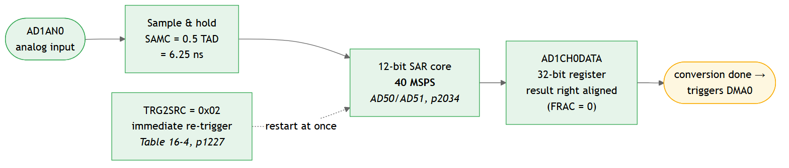

# dsPIC33AK512MPS512 on the dsPIC33 Curiosity Platform — ADC at 40 MSPS into RAM via DMA

A small, complete MPLAB X project showing **how to configure the device** so the
ADC runs at its maximum rate and the DMA moves the samples into RAM — and **how to
measure whether it really keeps up**. A command console on the board's USB-UART
channel controls it from a terminal or a script.

It is cut to the **EV74H48A** (dsPIC33 Curiosity Platform Development Board) with the
**dsPIC33AK512MPS512 General Purpose DIM** plugged in — the same hardware Microchip's own
40 MSPS example runs on. Order the two, open the project, press Program, and the LED
tells you whether the chain works, before you connect any signal. The source builds
unchanged for the other dsPIC33AK512MPS5xx parts; only the project's device selection and
the pin table differ.

Bare metal, no MCC. Every register write in the source cites the datasheet table or
page it comes from, so nothing has to be taken on trust.

## Existing examples we looked at first

Before writing anything we searched Microchip's own example organisation
[`microchip-pic-avr-examples`](https://github.com/orgs/microchip-pic-avr-examples/repositories?q=dspic33a)
for something that already did this. These are the ones we evaluated:

| Repository | What it does | What we took from it |
|---|---|---|
| [dspic33ak-curiosity-adc-40msps](https://github.com/microchip-pic-avr-examples/dspic33ak-curiosity-adc-40msps) | **40 MSPS ADC on dsPIC33AK128MC106 and dsPIC33AK512MPS512** — MCC-generated, runs on a Curiosity board. Reads conversions in software; **no DMA**. | Studied in detail. **Our clock setup and our ADC trigger scheme follow it**, because that code has been on silicon and ours has not. |
| [dspic33a-dac-dma-sinewave](https://github.com/microchip-pic-avr-examples/dspic33a-dac-dma-sinewave) | DAC fed by DMA to emit a 100 Hz sine without CPU intervention. | Checked for DMA setup patterns: it sets the DMA address window and clears the status flags by writing 0 — both of which we had wrong before the 2026-09-22 review. |
| [dspic33a-curiosity-dma-spi-eeprom-demo](https://github.com/microchip-pic-avr-examples/dspic33a-curiosity-dma-spi-eeprom-demo) | SPI transfers driven by DMA. | DMA, but not from an ADC and not at rate. |
| [dspic33a-code-examples](https://github.com/microchip-pic-avr-examples/dspic33a-code-examples) | Collection of smaller dsPIC33A examples. | Scanned for an ADC-plus-DMA combination; there is none. |
| [dspic33ak512mps506-dppim-demo](https://github.com/microchip-pic-avr-examples/dspic33ak512mps506-dppim-demo) | PWM and ADC on the dsPIC33AK512MPS506. | PWM-triggered conversion, not continuous sampling into memory. |

**The gap this project fills: ADC and DMA together, at full rate, with counters.**
The official 40 MSPS example proves the ADC reaches 40 MSPS. It does not answer how
much of that actually arrives in RAM, because it does not use the DMA — and on this
device all eight DMA channels share a single data bus (DS70005591D §13.4.4, p825),
with no throughput figure given anywhere.

**If you only need the ADC and can read conversions in software, use the official
example instead of this one.** It has run on hardware.

### What comes from where

To be precise about how much of this code rests on something that has run on silicon:

| Part of this code | Origin | Has run on hardware? |
|---|---|---|
| Clock setup: PLL1/PLL2 divider values, CLKGEN1/CLKGEN6 settings, switching sequence | bit-identical to the MCC-generated `clock.c` of [dspic33ak-curiosity-adc-40msps](https://github.com/microchip-pic-avr-examples/dspic33ak-curiosity-adc-40msps) | yes, in that example |
| ADC trigger scheme: Integration mode, software trigger starts a burst, the ADC's repeat timer paces the conversions (`MODE = 2`, `TRG1SRC = 1`, `TRG2SRC = 3`, `RPTCNT`, `AD3SWTRG`) | datasheet Example 16-4 (p1330) for the repeat timer; the example below and Example 16-6 (p1331) for the burst | partly — Microchip's example uses back-to-back (`TRG2SRC = 2`) and reads one 800-sample burst from `AD3CH0RES` in an assembler loop, **without DMA and without restarting the burst**. This code ran back-to-back first too; the board showed the delivered rate did not follow `SAMC` then (`docs/HARDWARE-LOG.md`, run 4), hence the repeat timer |
| DMA basics: `DMALOW`/`DMAHIGH` window, status flags cleared by writing 0, control register layout | MCC `dma.c` of [dspic33a-dac-dma-sinewave](https://github.com/microchip-pic-avr-examples/dspic33a-dac-dma-sinewave) and datasheet Examples 13-1 to 13-4 (p832 ff.) | yes — but memory-to-DAC in Repeated One-Shot mode, the opposite direction and a far lower rate |
| **ADC burst → DMA in Repeated Continuous mode → one buffer with `HALF`/`DONE` interrupts → burst restarted from the `DONE` ISR** | **our own construction**, assembled from datasheet §13.4.8 (Example 13-4, p835), §13.6.1.2 (HALF interrupt, p848) and §16.4.5 (p1322) | **no.** There is no Microchip example for this combination. This is the part `docs/TROUBLESHOOTING.md` §1.1 flags as the remaining risk |
| Self-test on the internal 15/16·VDD reference (ADxAN6) | the input and its sample time come from datasheet Example 16-3 (p1328), which uses it for gain calibration; the pass/fail logic is ours | the input yes, the check no |
| Board pins, UART2 on the MCP2221A channel, PPS codes, baud generator setting | the MCC-generated `pins.c` and `uart2.c` of the same 40 MSPS example (`RPINR13bits.U2RXR = 0x32`, `RPOR28bits.RP114R = 0x15`, `U2BRG = 0x364`) and the DIM info sheet | yes, in that example |
| Command parser (`cmd_parser.c/.h`) | [zabooh/cmd_parser](https://github.com/zabooh/cmd_parser), copied unchanged; it has run on a SAM E54 and a PIC32CM there | yes, on other targets — not yet on this one |
| Console commands, transport, receive interrupt (`cli.c`) | our own | no |
| Measurement counters, ISR, `main.c`, LED reporting, bounded waits, file structure | our own | no |

Nothing was copied verbatim. The examples served as the reference for register values
and patterns; every line here was written for this project and cites the datasheet
page it rests on.

## Read this first

**This code has never run on hardware.** It compiles and links cleanly with the real
compiler, and every bit set in it was read out of the datasheet and the device pack —
but nobody has executed it on a board or measured a signal with it. Treat it as a
clean scaffold with measurement points, not as a reference implementation.

Parts of this example were **AI-assisted**. All register names, bitfields and value
ranges were taken from datasheet **DS70005591D**, the errata **DS80001162E** and the
ATDF files of the **dsPIC33AK-MP_DFP** device pack, and each one is cited at the point
of use — so every setting can be checked against the primary source.

**Revision history**

- **2026-09-22, after the first report from a board** — the project's tool is the PKOB4
  (`pkob4hybrid`). A first attempt had run against a PC-side tool instead of the board
  and looked like a dead board; that was the whole cause. The project now has no
  alternative tool configuration at all — this example needs the hardware, so there is
  nothing to pick wrongly. A second change made in the same breath — setting
  `OSCCTRL.PLLxEN` and waiting for `PLLxRDY` before the first divider switch — was
  reverted after review: it rests on Example 16-3, a snippet from the ADC chapter whose
  own arithmetic is wrong, and it waits for a lock on the POR dividers. The clock code
  follows the MCC sequence again, which has run on silicon. The reasoning is in
  `clock_init()` and in `docs/TROUBLESHOOTING.md` so it does not get re-added.
  `regs` now also dumps `IEC3`/`IFS3`/`IPC12` and the console's own pin routing
  (`RPCON`, `RPOR28`, `RPINR13`, `TRISH`, `TRISD`) — with a silent console those were
  exactly the registers the troubleshooting guide asked for and the dump did not show.
- **2026-09-22, third revision** — moved to the **EV74H48A** with the dsPIC33AK512MPS512
  DIM (the board of Microchip's own 40 MSPS example): ADC3 on the mikroBUS A analog pin,
  LED0 on RC8, pin table below. A **command console** (`cli.c`, on the parser from
  [zabooh/cmd_parser](https://github.com/zabooh/cmd_parser)) on the MCP2221A USB-UART
  channel: `status`, `start`/`stop`, `samc`, `input`, `selftest`, `stats`, `dump`,
  `clear`, `led`, `reset`. The console runs in the UART receive interrupt below the DMA
  interrupt. The ADC core is now a compile-time choice (`ADC_INSTANCE`), so the
  potentiometer on ADC5 is two defines away.
- **2026-09-22, second revision** — tailored so that the first run needs nothing but
  the board: a **self-test** on the ADC's internal 15/16·VDD reference runs before the
  external input is used; **LED0 reports** heartbeat, error and a stop code; every
  hardware wait loop is **bounded** and reports where it gave up instead of hanging.
- **2026-09-22** — full review against the datasheet, the errata and Microchip's MCC
  examples. Four mistakes found and fixed, all of which would have stopped the first
  run dead: (1) the ADC was set to single-conversion mode with a re-trigger source,
  which the datasheet says is ignored in that mode — it would never have converted;
  (2) `DMALOW`/`DMAHIGH` were left at their reset value 0, so the first DMA write would
  have faulted and disabled the channel; (3) the DMA status flags were "cleared" by
  writing 1 — they clear on 0 — so every counter would have stuck; (4) the two sample
  buffers were swapped by rewriting the DMA destination inside the ISR while the
  transfer was already running, which splits every block. Details in the sections below
  and in `docs/TROUBLESHOOTING.md`.
- **2026-09-21** — first version.

## Getting started

**You need:** an EV74H48A (dsPIC33 Curiosity Platform Development Board) with the
dsPIC33AK512MPS512 GP DIM, a USB cable, MPLAB X with the XC-DSC compiler and the
dsPIC33AK-MP device pack (MPLAB X offers to download the pack when you open the
project). A signal source is optional — the self-test does not need one. A terminal
program (Tera Term, PuTTY, MPLAB Data Visualizer's terminal) is optional too — the LED
and the debugger tell you the same things.

1. Plug the board in. The PKOB4 debugger enumerates for programming, and the
   MCP2221A's COM port appears for the console (user guide DS70005562D 2.1.1).
2. Open `adc_dma_40msps.X`, press **Build**, then **Program** (or **Debug**).
3. The project's tool is the board's **PKOB4** (`pkob4hybrid`). Check it once in the
   Dashboard or under *Project Properties → Conn.* — it has to be a real debugger, or
   the code never reaches the board and the silent COM port looks exactly like a
   broken one.
4. Watch LED0 (green, the row of eight): **slow blink = everything works.** The
   self-test on the internal reference has passed, the ADC, the DMA and the interrupt
   are running at 40 MSPS. What the other patterns mean is under "First run on
   hardware".
5. Open the MCP2221A's COM port at 115200 8N1, press Enter, type `status`. The reply
   is the counter table; `help` lists the rest. See "The console" below.

Verified on 2026-09-22 with:

| Tool | Version |
|---|---|
| MPLAB X IDE | v6.35 (project format `version="65"`, which v6.25 also reads) |
| XC-DSC compiler | v3.31.00; the source also builds with v3.21 when the pack supplies the device |
| Device pack | dsPIC33AK-MP_DFP **1.4.260 and 1.3.185** — the source builds against both, `-Wall -Wextra` clean |
| Target | dsPIC33AK512MPS512 (project); the source also builds for the MPS506 |
| Board | EV74H48A + dsPIC33AK512MPS512 GP DIM, user guide DS70005562D, DIM info sheet DS70005563A |

**If MPLAB X complains about the toolchain version** when you open the project: the
`.X` has a version recorded in it, and yours will differ. Go to *Project Properties →
XC-DSC* and pick the version you have. Nothing in the source depends on it — we have
built this with v3.21 and v3.31, and the configuration bits are written so that the
pack version does not matter either (see "One trap worth knowing about" below).

### The board

Everything this example touches on the EV74H48A with the dsPIC33AK512MPS512 DIM, from
the DIM info sheet DS70005563A (Table 1, DIM pin → device pin → board function) and the
board user guide DS70005562D:

| What | Device pin | DIM pin | Where on the board | Note |
|---|---|---|---|---|
| **Analog input** AD3AN5 (default) | RA0 | P77 | **mikroBUS A, pin AN** | 0 … 3.3 V against GND. Same input as Microchip's 40 MSPS example. `ADC_INSTANCE 3`, `ADC_PINSEL 5` |
| Potentiometer AD5AN0 | RA7 | P66 | the 10 kΩ pot | for a knob-driven demo: `ADC_INSTANCE 5`, `ADC_PINSEL 0`, and `samc` ≥ 9 — the pot is a high-impedance source |
| Internal reference ADxAN6 | — | — | inside the ADC | 15/16·VDD, used by the self-test on every core |
| **LED0** | RC8 | P28 | leftmost of the eight green LEDs | driven high to light. LED1…7 are RC9…RC15 |
| S1, S2, S3 | RF3, RF0, RB2 | P45, P43, P41 | push buttons | active low, pull-up on the board; not used by this example |
| **Console UART2** | TX RH1 (RP114), RX RD1 (RP50) | P98, P96 | **MCP2221A USB-UART channel** — its own COM port | 115200 8N1, the channel Microchip's example streams to Data Visualizer on |
| Second UART | TX RH0 (RP113), RX RD10 (RP59) | P102, P100 | PKOB4 USB-UART channel, another COM port | not used by this console |
| Debugger | — | — | PKOB4 via the USB connector J24 | programming and debugging; the console's COM port is on the same USB cable, via the MCP2221A |
| GND | — | — | mikroBUS GND pins, test points | signal ground for the generator |

AD1AN0 of this device sits on RA2, which the board routes to a capacitive touch pad
(P38) — that is why the example uses ADC3 here and not ADC1.

The sources sit in the repository root — `main.c`, one `.c/.h` pair per module (`clock`,
`adc`, `dma`, `capture`, `led`, `diag`, `cli`/`console`), `board.h` and the parser pair
`cmd_parser.c/.h` — and the MPLAB X project references them there; nothing is duplicated.
`main.c` is the place to read first: it is the start-up order and the main loop, and
nothing else.

**This needs real hardware.** The clock generators, the PLLs, the ADC and the DMA are
the four things this example is about, and all four only exist on silicon. The number
that matters — `dma_overrun` staying at 0 at full rate — cannot be produced anywhere
else. The project is therefore set up for the board: the tool is the PKOB4
(`pkob4hybrid`). A second configuration, `sim`, runs the same code in the MPLAB X
simulator with a stand-in for the DMA — useful for the software above the DMA, useless
for the four things above; see "In the MPLAB X simulator" below.

One part is worth exercising on its own: `process_buffer()`. Write test values into
`buf`, call it directly, and you can check your arithmetic and its cycle count on a
host compiler without a board.

The `tools/` folder builds the same file from the command line without the IDE. **You
can ignore it** — we use it to check that the code compiles against different
compiler and pack versions.

## First run on hardware

Since this has never run on silicon, here is what to expect and where it is most
likely to trip you up.

### Step 1 — read the LED, no signal and no debugger needed

Program the board and watch LED0:

| LED0 | Meaning |
|---|---|
| **slow blink, 1 Hz** | running, self-test passed, no error counter has moved. This is the goal. |
| fast blink, 5 Hz | running, but an error counter is non-zero — `dma_overrun`, `late_service`, `proc_missed`, `dma_addr_err` or `dma_bus_err`. With one channel and nothing else on the CPU that should not happen; read the counters. |
| *n* short blinks, pause, repeat | stopped at a checkpoint; *n* is the code below. `fail_code` holds the same number. |
| dark, or steadily on | nothing runs at all: not programmed, no power, or stopped in a debugger |

The stop codes:

| Code | Stopped because | Look at |
|---|---|---|
| 1 | PLL1 (ADC clock) did not configure or lock | `PLL1DIV`, `OSCCTRL` |
| 2 | PLL2 (system clock) did not configure or lock | `PLL2DIV`, `OSCCTRL` |
| 3 | CLKGEN1 did not switch to PLL2 | `CLK1CON` |
| 4 | CLKGEN6 did not switch to PLL1 | `CLK6CON` |
| 5 | the ADC core never reported ready | `AD3CON`, `CLK6CON.CLKRDY` |
| 6 | no DMA blocks arrived, or the stream stopped later | `AD3CH0CNT.CNTSTAT`, `DMA0CNT`, `DMA0SEL`, `IEC2` |
| 7 | self-test value out of range | `selftest_mean` — expected ≈ 3840, window 3648 … 4032 |
| 8 | the DMA channel switched itself off | `dma_addr_err`, `DMALOW`, `DMAHIGH` |
| 9 | a CPU trap or an interrupt with no handler | the `[TRAP]` block on the console — it names the vector, the boot stage and the `INTCON*` cause bits. `docs/TROUBLESHOOTING.md` §2.0b |
| 10 | the fail-safe clock monitor moved the CPU to the backup FRC | the `[CLKF]` lines: `OSCCTRL`, `PLL2CON`, `CLK1CON` |
| 11 | something wrote past the end of the sample buffer | the `[guard]` lines: which of the 16 guard words behind `buf` changed and what it holds. A 12-bit value there means the DMA ran past the buffer |

**What the self-test proves.** Before the external pin is used, the code runs the
identical clock, ADC, DMA and interrupt chain on the ADC's internal 15/16·VDD reference
(AD3AN6, Table 16-2) and checks that the mean of a buffer half is 3840 ± 5 %. Only then
does it switch the channel to AD3AN5 — between two bursts, when the channel is idle. A
slow blink therefore means the whole chain has been verified on the silicon in front
of you, with a number, not just "something interrupts".

With a debugger attached you can additionally halt and read the counters:

| Variable | Should be |
|---|---|
| `blocks_done` | increasing — at 40 MSPS a buffer half completes every 25.6 µs, so this climbs fast |
| `selftest_mean` | ≈ 3840 |
| `last_sample` | changing once a signal is connected; noise around some level on an open pin |
| `dma_overrun` | **0** |
| `dma_addr_err` | **0** — non-zero means the DMA address window is wrong |
| `late_service`, `proc_missed` | **0** |
| `fail_code` | 0 |

### Step 2 — feed a signal in

**Which pin.** The code samples `AD3AN5` (`ADC_INSTANCE 3`, `ADC_PINSEL 5`), which is
**RA0** — on the Curiosity Platform board the **AN pin of mikroBUS socket A** (see "The
board" above). Signal to that pin, generator ground to a mikroBUS GND pin. On another
board or package, the input map is Table 16-2 of DS70005591D, from page 1224. Without a
generator, turn the potentiometer instead: it is on ADC5, two defines and a longer
sample time away (table above).

**What level.** 0 to 3.3 V, single ended against AVSS, unipolar (`DIFF = 0`). Anything
with a negative excursion gets clipped at the bottom.

**What frequency.** This matters more than people expect. One buffer half is 1024
samples, which at 40 MSPS is **25.6 µs**. A 1 kHz sine fills 2.5 % of one period — in
the buffer that is a straight line. For a recognisable waveform use something in the
**100 kHz to a few MHz** range, then several periods fit in the window.

**Source impedance — the most likely reason for odd values.** `SAMC = 0` means a sample
time of 0.5 TAD = 6.25 ns, and in that time your source has to charge the hold
capacitor. A 50 Ω function generator manages; a high-impedance divider or a long cable
does not, and you get values that are too small or smeared. If the picture looks wrong,
**`ADC_SAMC` at the top of the source is the first knob to turn** — raise it and see
whether the amplitude comes up.

### Step 3 — look at the buffer

The halves refill 39 000 times per second, so you have to stop the capture to see
anything: set a breakpoint in the DMA0 ISR, then view `buf` in the watch window or as
a memory view.

Which half to look at: `ready_half` says which one was completed last (0 = `buf[0]` to
`buf[1023]`, 1 = `buf[1024]` to `buf[2047]`). The DMA is filling the *other* one.

### If it does not work

| Symptom | Where to look first |
|---|---|
| MPLAB X halts on a line nobody set a breakpoint on ("break session") | a CPU trap or an unhandled interrupt. This build catches them: LED code 9 and a `[TRAP]` block naming the vector, the boot stage and the cause bits — `docs/TROUBLESHOOTING.md` §2.0b |
| LED blinks a code 1 … 5 | clock or ADC configuration — the code says which step; the registers to read are in the table above |
| LED code 6 right after programming | ADC not converting (`CNTSTAT` stays 0?), or wrong DMA trigger (`DMA0SEL`) |
| LED code 6 after a moment of blinking | the burst restart in the ISR did not take — `docs/TROUBLESHOOTING.md` §1.1 |
| LED code 7 | self-test mean off — read `selftest_mean`; far too low points at the sample time, way off at the clock |
| LED code 8 | the DMA disabled itself on an address fault — `DMALOW`/`DMAHIGH` |
| `dma_overrun` counting up | the shared DMA bus is not keeping up — see below, this is the interesting result |
| values far too small or flat | source impedance, raise `ADC_SAMC` |
| values look like a straight line | signal frequency too low for a 25.6 µs window |
| values above 4095 | `DMA0SRC` points at the accumulator (`AD3CH0DATA`) instead of `AD3CH0RES` |
| `late_service` or `proc_missed` counting up | the ISR or `main()` is not keeping up, reduce the processing or enlarge `SAMPLES_PER_HALF` |

Note that `dma_overrun` counting up is not a bug in this code — it is the measurement
this example exists for.

**If you get stuck, read [docs/TROUBLESHOOTING.md](docs/TROUBLESHOOTING.md).** It goes
through each wait loop and what being stuck there means, lists the symptoms in the order
you are likely to meet them, and — most usefully — **names the places where we are least
sure of our own code**, so you do not spend time on the parts that are solid.

## How it works

### 1. Clock tree


The part that differs from many other devices: **the fast peripherals do not hang off
the system clock.** There are two dedicated PLLs and fourteen clock generators, so
320 MHz at the ADC alongside a 200 MHz CPU is no contradiction. This example uses both
PLLs — PLL1 at 320 MHz for the ADC, PLL2 at 200 MHz for the system — so neither clock
needs a fractional divider.

**The switching order matters and is easy to get wrong.** Page 778 requires `PLLSWEN`
(apply input and feedback dividers), then `FOUTSWEN` (apply output dividers), then
`NOSC`, then `OSWEN`. Setting only the last two does not produce an error — it silently
leaves the old dividers in place and the part runs at the wrong speed.

Which generator feeds what is not stated in one place:

- **CLKGEN1 is the system clock** — §12.4.9, page 795: *"Clock Generator 1 is the
  clock source for the system clock (sys_clk) and peripheral clock."*
- **CLKGEN6 is the ADC clock** — Table 16-1, page 1223, column "Clock Source",
  together with "Max Input Clock 32 MHz to 320 MHz".

TAD derives from the ADC input clock: **TAD = 4 / F_IN** (parameter AD50, Table 40-39,
page 2034). At 320 MHz that is 12.5 ns, which is also the minimum — more than 320 MHz
is not specified (Table 40-24, page 2016). Hence the 40 MSPS (AD51, throughput
including 1.5 TAD conversion time).

A useful cross-check: the datasheet measures its own current consumption at exactly
this operating point — *"Input frequency 320 MHz, ADC clock 80 MHz, TAD 12.5 ns"*
(DC120/DC121, page 2008). So this is the intended setting, not brinkmanship.

`CLKxDIV` also has a 9-bit fractional divider `FRACDIV` next to the integer `INTDIV`,
so non-integer ratios are possible — but this example does not need one: both clock
generators take their PLL output straight through, `CLK1DIV = CLK6DIV = 0`.

### 2. ADC — one core, one channel, bursts of 2048 conversions paced by the repeat timer



| Field | Value | Why |
|---|---|---|
| `PINSEL` | 5 | analog input AD3AN5 = mikroBUS A AN on the EV74H48A (Table 16-2, from page 1224; `ADC_PINSEL`) |
| `NINSEL` | 0 | negative input on AVSS, i.e. single ended |
| `DIFF` | 0 | single ended → unsigned result |
| `FRAC` | 0 | integer, right aligned (page 1265) |
| `SAMC` | 0 | sample time 0.5 TAD = minimum (page 1266) |
| `MODE` | 2 | **Integration**: a burst of `CNT` conversions (page 1267) |
| `CNT` | 2048 | conversions per burst = one DMA buffer (`AD3CH0CNT`, page 1272) |
| `TRG1SRC` | 0x01 | **software trigger** starts the burst (Table 16-3, page 1226) |
| `TRG2SRC` | 0x03 | **repeat timer** triggers every further conversion (Table 16-4, page 1227): *"clocked from the ADC analog core clock (TAD), and its period is set by RPTCNT[5:0]"* (§16.4.5, page 1322) |
| `RPTCNT` | 2 | period of that timer in TAD = 12.5 ns → 40 MSPS nominal (`AD3CON[23:18]`, `ADC_RPTCNT`; `period <2..63>` at run time) |
| `IRQSEL` | 0 | channel event **after each conversion**, when `AD3CH0RES` is ready (page 1266) |
| `EIEN` | 0 | no early interrupt — note 4 on page 1265 forbids it with DMA |
| `ACCNUM` | 0 | oversampling only, unused in this mode |

**On the trigger choice**, since that was the original question — and since the first
version of this code got it wrong: there is no register setting that makes a channel
free-run forever. §16.4.5 (page 1322) is explicit:

- `TRG2SRC` *"are not used for a Single Conversion mode (MODE = 00)"*, and Table 16-3
  lists the back-to-back value as *reserved* for `TRG1SRC`. So "single conversion plus
  immediate re-trigger" converts exactly nothing.
- Back-to-back triggering (`0b000010`) and the repeat timer (`0b000011`) exist only as
  `TRG2SRC`, i.e. in the multisample modes (Window, Integration, Oversampling), and
  there the **first** conversion needs a `TRG1SRC` trigger. Integration mode then runs
  `CNT` conversions (max 65535) and stops.

That is why this code works in bursts: a software trigger starts 2048 conversions, the
ADC's repeat timer triggers each of them, and the DMA `DONE` interrupt — which arrives
when the 2048th sample has landed in RAM — starts the next burst. The gap between
bursts is the interrupt latency, once per 51.2 µs, so the measured rate will sit a
little below the nominal one.

**Why the repeat timer and not back-to-back.** The first version used `TRG2SRC = 2`,
back-to-back, like Microchip's own 40 MSPS example and datasheet Example 16-6. On the
board the rate sweep then showed the same overrun and missed counts for every `SAMC`
from 0 to 31 (`docs/HARDWARE-LOG.md`, run 4): the delivered rate did not follow the
sample time, the ADC simply ran as fast as it could — and §16.4.5 says of back-to-back
that *"the timing is affected (can be delayed) by priorities of other channels"*. The
repeat timer (`TRG2SRC = 3`, Example 16-4 on page 1330) is the ADC's own time base: one
trigger every `RPTCNT` TAD, deterministic, and the sweep measures it with Timer1.

Two more consequences of Integration mode that are easy to miss:

- **The per-conversion result is `AD3CH0RES`**, `RES[11:0]`. `AD3CH0DATA` is the
  accumulator of the whole burst (page 1270) — pointing the DMA there gives you a
  running sum, not samples.
- **`IRQSEL` must be 0** so that the channel event fires for every conversion; with
  `IRQSEL = 1` it fires once per burst and the DMA would move one value per 51.2 µs.

Lower rates are set through the sample time, the repeat timer or the ADC input clock —
see "Which sample rates you can get" below. PWM or SCCP triggers are only needed if
sampling must be tied to a switching event or run far below 1 MSPS, PTG only for
staggered sequences across several cores.

### 3. DMA into one buffer with two halves


| Field | Value | Why |
|---|---|---|
| `DMALOW` / `DMAHIGH` | 0x4000 / 0x13FFF | **the data RAM window — mandatory.** Both reset to 0; every transaction is checked against them (page 829, step 5) and an access above `DMAHIGH` sets `ADRERR` and clears `CHEN` (pages 810, 826). Taken from the device header (`__DATA_BASE`, `__DATA_LENGTH`). |
| `DMA0SEL` | 0x3B | trigger source "ADC3 Done CH0" (ATDF value group `DMA_SEL__CHSEL`; 0x2F … 0x48 for ADC1 … 5, follows `ADC_INSTANCE`) |
| `DMA0SRC` | `&AD3CH0RES` | the per-conversion result register |
| `SIZE` | 1 | **16-bit transfers** (page 812) |
| `SAMODE` | 0 | source address stays put |
| `DAMODE` | 1 | destination increments |
| `TRMODE` | 3 | repeated continuous |
| `RELOADD`, `RELOADC` | 1 | back to the buffer start after each block, in hardware (page 812) |
| `HALFEN`, `DONEEN` | 1 | one interrupt when the first half is full, one when the second is (page 848) |

**On 2 bytes per sample:** the DMA handles 8, 16 and 32-bit transactions, selected
through `SIZE[1:0]`. A 12-bit result therefore costs 2 bytes, not 4. `AD3CH0RES` is
32 bits wide with `RES[11:0]` in the low half and `RESF[11:0]` in bits 31:20 (register
summary, page 1229), so the 16-bit read of the low half is the sample.

**On the two halves:** the first version of this code used two separate buffers and
rewrote `DMA0DST` from the ISR to swap them. That cannot work at this rate — with
`RELOADD` the DMA restarts at the old address the moment a block completes, samples
keep arriving every 25 ns, and by the time the ISR rewrites the pointer a dozen of
them have landed in the buffer the CPU is reading, while the rest of the block goes
to the new address minus those samples. The hardware has the right tool for this:
the `HALF` flag. One buffer of 2048, an interrupt at the halfway point and one at the
end, and **no address is ever touched by software while the channel runs**.
(The device also has a hardware ping-pong mode across a channel pair, `PPEN`/`PCHEN`,
§13.4.11 page 841 — more than this example needs.)

**On the status flags:** `DMAxSTAT` bits are *R/C/HS* — set by hardware, **cleared by
writing 0** (legend page 815; Example 13-4 page 835 does `DMA0STATbits.DONE=0`).
Writing 1, as the first version did, leaves them set.

At 40 MSPS one half is 25.6 µs of signal and the interrupt arrives at about 39 kHz.
The ISR only clears flags, notes which half is complete, counts errors and — at `DONE`
— restarts the ADC burst. Deliberately short, because at this rate a long ISR becomes
the cause of the next overrun.

### 4. What the CPU does, and what to measure


## The console

Open the MCP2221A's COM port (115200 8N1). At start-up the firmware prints a banner
with the build time stamp, then the `> ` prompt; if you connect later, press Enter and
the prompt answers:

```
adc_dma_40msps - ADC at 40 MSPS into RAM via DMA
board: EV74H48A, dsPIC33AK512MPS512 GP DIM
build: Sep 22 2026 14:31:07
type 'help' for the commands
>
```

The console is the [zabooh/cmd_parser](https://github.com/zabooh/cmd_parser) module in
`cmd_parser.c`, unchanged, with the commands of this example in `cli.c`:

| Command | Does |
|---|---|
| `help` | lists the commands |
| `version` | build date, board, ADC core, default input |
| `status` | run state and every counter from "What to measure", plus input, sample time, self-test mean and stop code |
| `regs` | the clock, ADC, DMA, interrupt and UART registers as hex, plus the counters — the dump `docs/TROUBLESHOOTING.md` Part 4 asks for |
| `start`, `stop` | start the burst stream / let the current buffer finish and stop |
| `samc <0..31>` | sample time in TAD steps: (2·SAMC + 0.5) TAD — the aperture, not the rate. Applied between two bursts |
| `period <2..63>` | **the sample rate:** period of the ADC repeat timer in TAD (12.5 ns), rate = 80000 / n kSPS: 2 = 40 MSPS, 4 = 20 MSPS, 8 = 10 MSPS, 63 = 1.27 MSPS. Applied between two bursts |
| `input <0..15>` | PINSEL of the ADC core; 6 is the internal 15/16·VDD reference. Applied between two bursts |
| `selftest` | samples the internal reference, prints the mean, NAK if it is outside 3648 … 4032 |
| `stats` | min, max, mean and peak-to-peak of the completed half |
| `dump [count] [offset]` | samples of the completed half, eight per line; Ctrl+C aborts |
| `clear` | zeroes the error counters |
| `led on`, `led off`, `led auto` | LED0 by hand, or back to the heartbeat |
| `sweep [halves]` | **the rate measurement, automated:** for repeat-timer periods 63, 32, 16, 8, 4, 3, 2 TAD (1.27 … 40 MSPS nominal) runs `halves` buffer halves (default 2000 = 2 M samples) and prints one line per rate with the **measured** sample rate (Timer1) next to the nominal one, `SAMC` read back from the register, and `dma_overrun` measured three ways — CPU idle, CPU processing every half like the main loop, CPU polling an SFR in a tight loop — plus `late_service` and `proc_missed`. A rate is usable where overrun stays 0; the three columns say whether the DMA bus or the CPU is the limit. Takes a few seconds; restores the previous sample time and run state. With `AUTO_SWEEP 1` in `board.h` (the default) the same table is printed once automatically after the self-test, before the measurement starts — no typing needed |
| `reset` | software reset |

**The firmware also talks without being asked.** From reset on, every start-up step
reports itself on the same port — the UART is brought up on the 8 MHz FRC before the
clocks are touched and re-timed once PLL2 runs — so a terminal log from power-up reads
like this on a good day:

```
[boot] uart up on FRC, 115200 8N1
[boot] adc_dma_40msps Sep 22 2026 15:02:11
[clk] CLK1CON at entry: 0x00000101
[clk] PLL1 locked, 320 MHz
[clk] PLL2 locked, 200 MHz
[boot] uart reclocked to PLL2, 115200 8N1

adc_dma_40msps - ADC at 40 MSPS into RAM via DMA
board: EV74H48A, dsPIC33AK512MPS512 GP DIM
build: Sep 22 2026 15:02:11
type 'help' for the commands
please log this terminal from power-up and send it back
>
[adc] core ready, Integration mode, CNT 2048
[adc] pinsel: 5
[adc] samc: 0
[dma] channel 0 armed, IRQ on; address window = the buffer:
[dma] DMALOW: 0x00004070
[dma] DMAHIGH: 0x0000506F
[boot] self-test on the internal reference
[selftest] mean on internal 15/16 VDD (expect ~3840): 3851
[boot] self-test passed, measurement running on the external input
[stat] blocks=195312 overrun=0 late=0 missed=0 addr_err=0 bus_err=0 last=2047 input=5 samc=0 run=1
[stat] blocks=390624 overrun=0 ...
```

A `[stat]` line comes every 5 s for the first minute, then every minute. If a step
fails, the log ends with `[FAIL] code n`, the reason in words, and the full register
dump (`[regs] …`) — the same thing the `regs` command prints — and then LED0 blinks
the code. **That log is what to send back** if the board is not on your desk: it
answers most of `docs/TROUBLESHOOTING.md` Part 4 without a debugger.

Two things about it are worth knowing:

- **The console is its own thread.** Received bytes are handled in the UART2 receive
  interrupt at priority 1; a command runs there, output included. The DMA interrupt
  (priority 4) preempts it, so the measurement never waits for the console. `main()`
  does: during a long `dump` it processes no buffer halves, and `proc_missed` says so.
  That is deliberate — the counter is the measurement, not a bug.
- **A script can drive it.** After every command the parser sends the prompt followed
  by one control byte: ACK (0x06) if the command succeeded, NAK (0x15) if it failed.
  A script reads until that byte, checks it, and only then sends the next line. Usage
  errors give NAK and a usage line; an unknown command gives NAK. The reference client
  for that protocol is `test/cmd_parser_host/cmd_console.py` in the parser's repository,
  (`test/cmd_parser_host/cmd_console.py`).

## Which sample rates you can get

All figures are **per ADC core**; the dsPIC33AK512MPS512 has five (Table 16-1,
page 1223).

**The basis.** The ADC clock period is TAD = 4 / F_IN, with F_IN allowed from 32 to
320 MHz, so TAD runs from 12.5 to 125 ns (AD50, page 2034). One conversion takes the
sample time plus 1.5 TAD; with the minimum sample time of 0.5 TAD that is 2 TAD, hence
40 MSPS at 320 MHz (AD51). There are three knobs.

**1. Sample time `SAMC` with the back-to-back trigger — the way the first version of
this example ran, and what the board did not confirm.** Sample time is (2·SAMC + 0.5)
TAD (page 1266), so the conversion period should be (2·SAMC + 2) TAD. At 320 MHz input
clock that would give:

| `SAMC` | Rate |
|---|---|
| 0 | 40 MSPS |
| 1 | 20 MSPS |
| 2 | 13.3 MSPS |
| 3 | 10 MSPS |
| 4 | 8 MSPS |
| 9 | 4 MSPS |
| 31 | 1.25 MSPS |

That is 40 / (SAMC + 1) MSPS on paper. On the board the delivered rate did not change
with `SAMC` at all (`docs/HARDWARE-LOG.md`, run 4), so this example no longer relies on
it. `SAMC` remains the remedy for a source impedance that is too high for a 6.25 ns
sample window — it sets the aperture, the repeat timer sets the rate.

**2. Repeat timer — the way this example runs now** (`TRG2SRC = 3`, period in
`RPTCNT[5:0]` of `AD3CON`, page 1258; `ADC_RPTCNT` in `board.h`, `period` on the
console). A trigger every k TAD, k = 2 … 63, at TAD = 12.5 ns: 80 / k MSPS, i.e. 40,
26.7, 20, 16, 13.3, 11.4, 10, 8.9, 8 … down to 1.27 MSPS. A finer grid than `SAMC`,
but **25 MSPS is not on it**. Whether the hardware counts k or k + 1 cycles is what the
measured column of the sweep table says.

**3. The ADC input clock, CLKGEN6.** Rate = F_IN / 8 at `SAMC = 0`. With the 9-bit
fractional divider in `CLK6DIV` almost any value between 4 MSPS (32 MHz) and 40 MSPS is
reachable — 25 MSPS, for example, with 200 MHz in. Combined with `SAMC` or the repeat
timer the range extends down to about 125 kSPS (32 MHz, k = 64).

**Below that** the burst mechanism is the wrong tool. For rates like the 40 kHz of a
piezo grain sensor, use Single Conversion mode with an SCCP or PWM trigger as
`TRG1SRC`: the DMA transfer per conversion works exactly the same way, and the burst
restart disappears entirely. That goes down to a few Hz.

Three caveats:

- The figures are per core. Five cores together are nominally 200 MSPS — whether the
  single DMA bus carries that is precisely the open question this example is meant to
  measure.
- The burst restart costs one interrupt latency per 2048 samples, so the measured rate
  sits a few tenths of a percent below the nominal value.
- AD51 carries the footnote "design guidance only, not characterised or tested in
  manufacturing". 40 MSPS is the design target, not a tested limit.

## The point of the whole thing

One sentence in the datasheet matters more for this project than any ADC register,
§13.4.4 on page 825:

> *"While DMA channels can function independently to service different peripherals at
> the same time, they are still limited by the presence of a single DMA data bus and a
> single data channel to data space."*

**So the eight DMA channels are not eight parallel data paths.** They share one bus,
and when they contend an arbitration decides (fixed or round robin via
`DMACON.PRIORITY`). For scale: three channels at 40 MSPS and 2 bytes are 240 MB/s
across that one bus, five channels 400 MB/s. **How much it actually carries is not in
the datasheet** — there is no figure in transfers per second, and the DMA does not
appear in the peripheral clock table either.

That is why this code has counters instead of claims.

## What to measure

Read these in the debugger after a run:

| Variable | Meaning | Expectation |
|---|---|---|
| `blocks_done` | completed buffer halves | × 1024 / elapsed time = **actual sample rate** (includes the burst restart gap) |
| `dma_overrun` | `DMA0STAT.OVERRUN` seen: triggered again before the previous transfer finished (page 816) | **must stay 0**, otherwise samples were lost on the DMA bus |
| `late_service` | ISR found `HALF` and `DONE` pending together, i.e. it was more than one half late | **must stay 0** |
| `proc_missed` | `main()` did not reach a completed half before the next one finished | **must stay 0** |
| `dma_bus_err` | bus write error (`BWERR`; `BRERR` needs `RETEN`, see errata) | 0 |
| `dma_addr_err` | access outside `DMALOW`…`DMAHIGH` | 0 |
| `last_sample` | last value of the completed half | changing = data really moving |
| `ready_half` | which half completed last | alternating 0 / 1 |
| `selftest_mean` | mean of a half sampled on the internal 15/16·VDD reference | ≈ 3840 |
| `fail_code` | stop code, same number the LED blinks | 0 |

A sequence we would suggest:

1. **One channel, 40 MSPS.** Does `dma_overrun` stay at 0 over a longer run? That
   proves the basic configuration.
2. **Two channels.** Set up ADC2 the same way, second DMA channel
   (`DMA1SEL = 0x35`, "ADC2 Done CH0"). This is where the shared bus first shows its
   limit.
3. **Three channels.** If overruns appear here, the limit is found — with a number the
   datasheet cannot give you.
4. **Only then add the processing.** `process_buffer()` is deliberately written as a
   placeholder loop over every sample, so the cost of touching each value is visible.

## If the bandwidth is not enough

The ADC can average internally, before a DMA transfer even happens — Oversampling mode
(`MODE = 3`) with `ACCNUM[1:0]` in `AD3CH0CON1` (page 1266):

| `ACCNUM` | Samples | Result width |
|---|---|---|
| 0b00 | 4 | 13 bit |
| 0b01 | 16 | 14 bit |
| 0b10 | 64 | 15 bit |
| 0b11 | 256 | 16 bit |

At 16× averaging, 240 MB/s becomes 15 MB/s and the result still fits in 2 bytes with
14 bits. Sampling stays at 40 MSPS; only the output rate drops. In that mode the
averaged result lives in `AD3CH0DATA` and the channel event with `IRQSEL = 1` fires
once per average — so `DMA0SRC`, `IRQSEL` and the burst restart change accordingly.

**Whether that is an option depends on your measurement method** — for a pure
amplitude measurement it helps, for a phase-based method averaging can destroy the
information. That is worth a phone call.

`MODE[1:0]` also offers Window mode (gated by an external signal), and the last three
setting channels have a second accumulator for second-order filters.

## What this code does not do

- **No PWM and no clock output.** For an external DAC above 120 MHz a controller pin
  is not the way: the output pins are specified with 2.3 ns rise and 1.7 ns fall time
  (Table 40-26, page 2017, at 25 pF). At 120 MHz one period is 8.3 ns — four of those
  nanoseconds would be edges. The datasheet states no maximum PWM output frequency,
  and none for the Reference Clock Output either.
- **No multiple channels.** On purpose: one should be provably working first.
- **No interrupt prioritisation, no error recovery, no calibration.** The ADC can
  recalibrate itself periodically (`ACALEN` and `CALRATE` in `AD3CON`) — worth a look
  for a longer measurement.
- **No statement on analog input bandwidth.** The datasheet does not give one, and the
  input parameters it does give (hold capacitance, pin capacitance, interconnect
  resistance) all carry the note "design guidance only, not tested". The ENOB of
  10.5 bits was characterised with a 1 kHz sine and says nothing about high input
  frequencies.
- **No gapless stream.** The burst restart costs one interrupt latency per 2048
  samples. If that matters, the datasheet's hardware ping-pong across two DMA channels
  and a second ADC channel alternating bursts would close the gap — a different
  example.

## Errata

Silicon errata DS80001162E (rev. E, July 2026) was checked. Nothing in it concerns
the ADC, the PLLs or the clock generators. Two items touch this code: `BRERR` is only
reported when `RETEN` is set (item 2 — this code leaves it clear, so `dma_bus_err`
counts write errors only), and on **rev A1 silicon** the compiler option
`-merrata=base_offset` is recommended (item 22). `docs/TROUBLESHOOTING.md` has the
details.

## One trap worth knowing about

The symbolic values of two configuration bits were **renamed between pack versions**
(all other names are identical in both packs — ATDF value-groups compared):

| Bit | dsPIC33AK-MP_DFP 1.3.185 | dsPIC33AK-MP_DFP 1.4.260 |
|---|---|---|
| `FICD_NOBTSWP` | `ON` / `OFF` | `BTSWP_ENABLED` / `BTSWP_DISABLED` |
| `FWDT_RCLKSEL` | `BFRC256` | `BFRC244` |

Both spellings name the same bits (FICD mask 0x8000, value 0x0 = BOOTSWP enabled; FWDT
mask 0xC0, value 0x3 = WDT clock BFRC divided down to 32.78 kHz). If MCC
generates `config_bits.c` against one pack and the build uses another, the compiler
rejects a value that is perfectly valid elsewhere:

```
error: unknown value for configuration setting 'FICD_NOBTSWP': 'BTSWP_ENABLED'
```

**This is very likely why an MCC-generated `config_bits.c` suddenly stops compiling:**
MCC generated it against a different pack than the build is using. The value is not
wrong — the spelling belongs to another pack version.

This project sidesteps the problem by writing those two bits **numerically**:

```c
#pragma config FICD_NOBTSWP = 0x0   /* BOOTSWP enabled */
#pragma config FWDT_RCLKSEL = 0x3   /* BFRC/244 (1.4.260) = BFRC/256 (1.3.185) */
```

Every pack version accepts that. Verified: `config_bits.c` built against packs 1.3.185
and 1.4.260 produces a **bit-identical configuration area** in the HEX file (the only
bytes that differ between the two builds are the `__TIME__` string). So the numeric
form is not a workaround with side effects — it is the same setting, spelled in a way
that does not depend on the pack.

`config_bits.c` sets **every** configuration word of the device explicitly, so the
programmed state does not depend on what the programmer does with words a project
leaves out. Apart from the two above and `FWDT_WDTEN = SW` (watchdog off unless the
software turns it on), every value is the erased default; the file says for each
register why that is right for this example. The one to never change by accident is
`FPED_ICSPPED`: `ON` would stop the PKOB4 from programming the part.

The same trick works for any configuration bit whose symbolic names have moved: look
the value up in the ATDF (`<value-group name="FICD_NOBTSWP">`) and write the number.

## In the MPLAB X simulator

The simulator has no PLL, no ADC conversion and no DMA transfer, and in this project it
does not dispatch interrupts either (any pending interrupt aborts the run with
`E0110-SIM: Failed to execute instruction`; MPLAB X v6.35, checked 22.09.2026). So the
DMA interrupt — the only producer of data on silicon — never runs there. The simulator
build therefore swaps one module: `sim_dma.c` replaces `dma.c`. It implements the same
`dma.h` interface without a DMA and delivers a buffer half whenever the firmware would
otherwise wait for one (`SIM_DMA_TICK()` in `sim.h`, empty on silicon): a 1 MHz sine
on the measurement input, a flat 3840 on the self-test input, through the same
`dma0_event()` path the interrupt uses. Everything above that — counters, the burst
restart, `capture_service()`, the self-test, the console — runs unchanged. The clock and
ADC waits are no-ops (`WAIT_WHILE` in `diag.h`), and three spots in `cli.c` skip what
the simulator's UART model cannot do (no receiver, `TXMTIF` never set).

Two ways to build it:

- MPLAB X: configuration **`sim`** (tool Simulator, `dma.c` excluded, `sim_dma.c`
  included, `__MPLAB_DEBUGGER_SIMULATOR=1` defined).
- Command line: `tools\build.bat sim` or `make -C tools sim` → `build\adc_dma_40msps_sim.elf`.

`tools\sim_trap.py` drives that ELF in MDB, the command-line debugger, routes UART2 to a
file and prints the result. The expected log ends with

```
[selftest] mean on internal 15/16 VDD (expect ~3840): 3840
[simtest] halves compared against the sine vector: 100
[simtest] full ping-pong buffers: 50
[simtest] halves with a mismatch: 0
[simtest] PASS: ping-pong order and data intact
```

The **ping-pong check** is what the simulator build is for: `sim_dma.c` writes a known
vector, so every half that `process_buffer()` receives through `capture_completed_half()`
is compared with it, and the phase must continue from the previous half (1024 mod 40 =
24 samples). A half served twice, two halves swapped, a wrong pointer or a corrupted
region all show up as a mismatch with the index. The negative test,
`sim_trap.py --fault 65536`, drops one sine sample mid-run and must end in
`[simtest] FAIL` with a mismatch at index 0. DMA status masks written the same way
(`--fault 8` = OVERRUN) exercise the error counters.

What it does not cover: timing and throughput, the interrupt path, the DMA address
window and real DMA errors, the clock tree — everything the hardware run is for. A
simulator run takes about 2.5 minutes for the 100 halves.

## Files

| Path | Contents |
|---|---|
| `main.c` | start-up sequence and the main loop — the order of the inits, and why |
| `board.h` | everything board-specific: the compile-time choices (`ADC_INSTANCE`, `ADC_PINSEL`, `ADC_SAMC`), the LED pin, the console pins |
| `config_bits.c` | every configuration word of the device, with the reason for each value — and why two of them are written as numbers |
| `clock.c`, `clock.h` | FRC → PLL1 320 MHz (ADC) and PLL2 200 MHz (CPU), the switching order, the clock-fail interrupt |
| `adc.c`, `adc.h` | the ADC core: channel 0 in Integration mode, burst trigger, input/sample-time register |
| `dma.c`, `dma.h` | DMA channel 0: address window, Repeated Continuous mode, HALF/DONE interrupt, status flags — knows no ADC and no buffer |
| `sim_dma.c`, `sim.h` | **simulator build only:** stand-in for `dma.c` that produces buffer halves (1 MHz sine) and the ping-pong check; see "In the MPLAB X simulator" |
| `capture.c`, `capture.h` | the measurement: wires ADC and DMA together, handles the DMA events with every error counter and the burst restart, start/stop/input, self-test, per-half processing — what the console may read and control |
| `led.c`, `led.h` | LED0 |
| `diag.c`, `diag.h` | stop codes (`fail()`), trap and unhandled-interrupt handler, boot-stage record, register dump |
| `cli.c`, `console.h` | the console: UART2 on the MCP2221A channel, the receive interrupt, the commands |
| `cmd_parser.c`, `cmd_parser.h` | the command parser, unchanged from [zabooh/cmd_parser](https://github.com/zabooh/cmd_parser) (Apache 2.0) |
| `adc_dma_40msps.X/` | MPLAB X project — build, program and debug from here |
| `docs/TROUBLESHOOTING.md` | **what to do when it does not work** — including where we doubt our own code |
| `docs/HARDWARE-LOG.md` | every run on the board, dated: what the log said, what was changed because of it |
| `CLAUDE.md` | working notes for continuing with Claude Code: module rules, build and verification steps, open questions |
| `docs/*.png`, `docs/*.mmd` | the block diagrams above, with their Mermaid sources |
| `tools/sim_trap.py` | drives the simulator build in MDB and reports the verdict ("In the MPLAB X simulator" above) |
| `tools/` | command-line build without the IDE; **ignore this unless you want it** |

### About `tools/`

Only needed to build without MPLAB X:

```
cd tools
python setup.py          # find compiler and pack, configure build.bat and Makefile
build.bat                # build
```

`setup.py` scans for installed XC-DSC compilers and dsPIC33AK-MP packs, in both
places they can live (`%USERPROFILE%\.mchp_packs` and MPLAB X's own `packs` folder),
lets you choose, and writes the paths into `build.bat` and `Makefile`. With
`--verify` it also runs a real test build. `--list` just shows what it found.

Two things that cost us time there, in case you build without the IDE:

1. `-mdfp` must point at the **`xc16` subdirectory** of the pack, not the pack root —
   otherwise the compiler reports "does not seem to support the selected device"
   although the pack does contain it. `c30_device.info` lives one level down.
2. The **linker script must be given explicitly** with `-T`
   (`support/dsPIC33A/gld/p33AK512MPS512.gld` inside the pack). Without it the
   compiler links against a 30F architecture and stops with "incompatible with
   30Fxxxx output".
